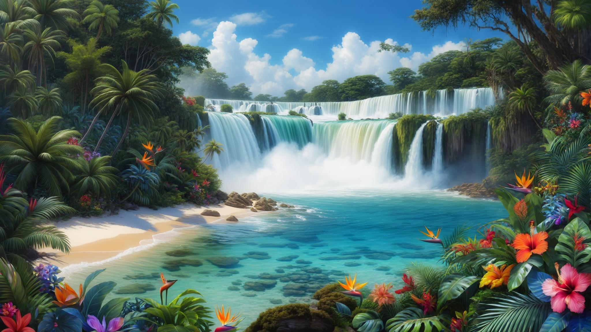
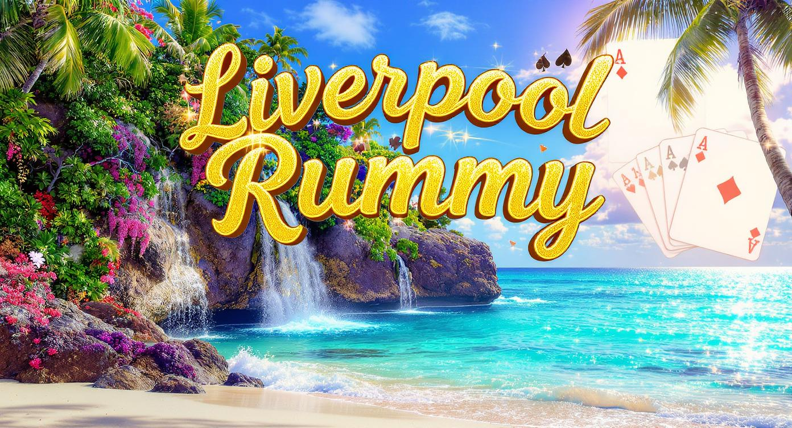

# Liverpool Rummy

This is my first multi-player card game written using Godot 4.5 using GDScript.

# Backgrounds

Believe it or not, this project started because of the backgrounds.
I had paid for a subscription to [Luma AI](https://lumalabs.ai) while creating
https://on-demand-books.com and thought it would be nice to make some peaceful
images with tropical ocean-front landscapes and waterfalls, and it did an
amazing job. I was so pleased with the results that I thought it might be
fun to use them in a game that incoporated them as background images.

Here are some backgrounds that didn't make it into the game but are nevertheless
really nice:

Also, [OpenArt](https://openart.ai/) did a fine job creating a splash screen:

# Why Godot?

Godot is a powerful and performant game engine that is free and open-source.
It also provides multi-player support with no required addons.

# Why Liverpool Rummy?

As a kid, my Grandma loved to play card games with anyone and everyone
who would play with her. Liverpool Rummy was her favorite card game and
loved to teach it to others. This game is dedicated to her.

# Playing Cards

I started with a copy of the following, although the website no longer exists:

Vector Playing Cards 3.2
https://totalnonsense.com/open-source-vector-playing-cards/
Copyright 2011,2021 - Chris Aguilar - conjurenation@gmail.com
Licensed under: LGPL 3.0 - https://www.gnu.org/licenses/lgpl-3.0.html

At the scale I was using the cards, I felt they were really hard to read,
so I used https://graphite.rs to completely rebuild each card. I ended up
only using the Jack, Queen, King, and Joker artwork from the originals,
and significantly scaled them up and cropped them mercilously.

The SVG card backs are from this collection.

# Why English and German?

I have a friend in Switzerland who does not speak a word of English. (Hi Zdenek!)
He's an avid game writer, who also inspired me to start writing this game.
I figured that it might be nice for him to be able to play the game too, which
required that it could be built it using German text.

# AI Assistance

After spending hundreds of hours developing this game, I came to the point
where I had written the hand evaluation algorithm for round 1 and it was
time to write a hand evaluation algorithm that would support all rounds.

My favorite programming language is [Go](https://go.dev), and one of my least
favorite programming languages is Python (which is GDScript resembles), so
I wrote the more complex hand evaluation algorithm in Go with a huge suite
of unit tests (since unit testing is a core beautiful feature of Go).

After the Go hand evaluator was completed, I had the daunting task of making
it work in GDScript, which I was dreading. It turns out that [David Crawshaw](https://crawshaw.io/)
(Co-Founder at [Tailscale](https://tailscale.com/) whom I had worked with
at Google and have a lot of respect for) wrote https://sketch.dev with some
of his buddies which quickly converted my rather large algorithm back to GDScript
with apparent ease.

With the huge assistance from sketch.dev, I also asked it to write unit tests
and GitHub Actions workflows. Although it had more challenges with these last
two tasks, it still was a huge timesaver, and I highly recommend it.

Early on, I had https://claude.ai help writing the shuffling animations, but
those ended up being pretty buggy and needed a lot of work to get something
remotely usable. The results from [DeepSeek](https://www.deepseek.com/en) were worse.

I believe that's the extent of the involvement of AI in this project.

# Status

There are still bugs that are quite infuriating during gameplay.
The most infuriating bug of all is that it doesn't yet choose the optimal meld
combination with the most clever usage of Jokers, leaving you holding
in your hand a card that could have easily been played on a run but the
Joker was used on a group instead. This can mean the difference between
winning and losing a round.

----------------------------------------------------------------------

Enjoy!

----------------------------------------------------------------------

# License

Copyright 2025 Glenn M. Lewis. All Rights Reserved.

Licensed under the Apache License, Version 2.0 (the "License");
you may not use this file except in compliance with the License.
You may obtain a copy of the License at

    http://www.apache.org/licenses/LICENSE-2.0

Unless required by applicable law or agreed to in writing, software
distributed under the License is distributed on an "AS IS" BASIS,
WITHOUT WARRANTIES OR CONDITIONS OF ANY KIND, either express or implied.
See the License for the specific language governing permissions and
limitations under the License.

----------------------------------------------------------------------
