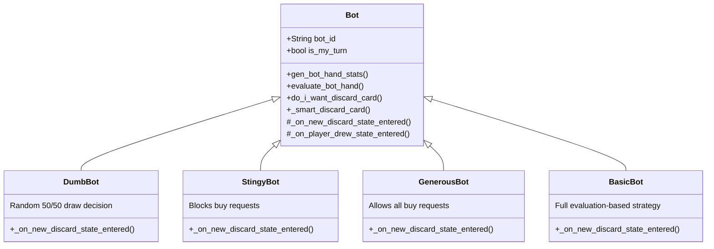
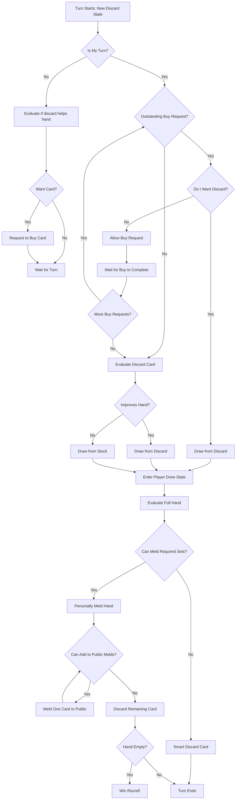

# Bot AI System

Moonridge Rummy features a sophisticated bot AI system with four different bot personalities, ranging from simple random play to strategic evaluation-based decision-making. This document explains how the bots think and make decisions.

## Overview

**Files:**
- `players/00-bot.gd` - Base Bot class with shared logic
- `players/01-dumb_bot.gd` - Random decision bot
- `players/02-stingy_bot.gd` - Defensive, blocking bot
- `players/03-generous_bot.gd` - Cooperative bot
- `players/04-basic_bot.gd` - Strategic, evaluation-based bot (default)

## Bot Architecture



## The Four Bot Personalities

### 1. DumbBot 🎲

**Strategy:** Random chaos

**Behavior:**
- **Draw Decision:** 50% random chance to draw from discard pile, 50% from stock
- **Buy Requests:** 50% random chance to allow
- **Discard Strategy:** Uses smart discard (never discards last drawn card or jokers)

**Code:**
```gdscript
func _on_new_discard_state_entered():
    if randf() < 0.5 and len(Global.discard_pile) > 0:
        _draw_card_from_discard_pile()
    elif Global.has_outstanding_buy_request():
        Global.allow_outstanding_buy_request(bot_id)
    else:
        _draw_card_from_stock_pile()
```

**Characteristics:**
- Unpredictable
- Can still win due to smart discard
- Good for beginners to play against
- Provides variety in multi-bot games

---

### 2. StingyBot 💰

**Strategy:** Defensive blocking

**Behavior:**
- **Draw Decision:** Evaluates if discard helps, but if ANY player wants to buy, takes it to block them
- **Buy Requests:** NEVER allows others to buy
- **Discard Strategy:** Uses smart discard (from base class)

**Code:**
```gdscript
func _on_new_discard_state_entered():
    if Global.has_outstanding_buy_request():
        _draw_card_from_discard_pile()  # Block the buy!
    else:
        var want_discard_card = simplified_do_i_want_discard_card()
        if want_discard_card:
            _draw_card_from_discard_pile()
        else:
            _draw_card_from_stock_pile()
```

**Characteristics:**
- Aggressive blocking
- Denies opponents cards they want
- Can slow down the game
- Makes strategic evaluation for own benefit
- Challenging opponent

---

### 3. GenerousBot 🤝

**Strategy:** Cooperative play

**Behavior:**
- **Draw Decision:** Evaluates if discard helps own hand
- **Buy Requests:** ALWAYS allows others to buy
- **Discard Strategy:** Uses smart discard (from base class)

**Code:**
```gdscript
func _on_new_discard_state_entered():
    if Global.has_outstanding_buy_request():
        Global.allow_outstanding_buy_request(bot_id)
        return
    var want_discard_card = simplified_do_i_want_discard_card()
    if want_discard_card:
        _draw_card_from_discard_pile()
    else:
        _draw_card_from_stock_pile()
```

**Characteristics:**
- Friendly to opponents
- Focuses on own hand building
- Easier to play against
- Good for learning game mechanics

---

### 4. BasicBot 🧠 (Default)

**Strategy:** Full strategic evaluation

**Behavior:**
- **Draw Decision:** Complex evaluation with buy request management
- **Buy Requests:** Evaluates whether to allow based on hand quality
- **Discard Strategy:** Uses smart discard (from base class)
- **Melding:** Automatically melds when hand meets requirements
- **Public Melding:** Adds cards to other players' melds optimally

**Code:**
```gdscript
func _on_new_discard_state_entered():
    var current_hand_stats = gen_current_hand_stats()
    var current_hand_evaluation = evaluate_bot_hand(current_hand_stats, bot_id)
    var current_eval_score = current_hand_evaluation['eval_score']
    var want_discard_card = do_i_want_discard_card(current_hand_stats, current_eval_score)

    if not is_my_turn:
        if want_discard_card:
            Global.request_to_buy_card_from_discard_pile(bot_id)
        return

    if not want_discard_card and Global.has_outstanding_buy_request():
        Global.allow_outstanding_buy_request(bot_id)
        return

    if want_discard_card:
        _draw_card_from_discard_pile()
    else:
        _draw_card_from_stock_pile()
```

**Characteristics:**
- Most sophisticated AI
- Strategic buy request handling
- Optimal melding decisions
- Challenging for experienced players

## Decision-Making Process

### Draw Phase Decision Tree



## Hand Evaluation System

The core of the bot AI is the hand evaluation system that scores hands and determines optimal play.

### Evaluation Phases

**Pre-Meld Phase** (before first meld):
- Focuses on building required groups/runs
- Considers joker placement
- Evaluates potential melds
- Does NOT consider public melding yet

**Post-Meld Phase** (after first meld):
- Focuses on going out (emptying hand)
- Prioritizes public melding opportunities
- Minimizes penalty cards
- Attempts to win the round

### Evaluation Scoring

```gdscript
eval_score = (publicly_meldable_cards * 100) - penalty_card_points

if is_winning_hand:
    eval_score += 1000
```

**Scoring Breakdown:**
- **Publicly Meldable Cards:** +100 points per card that can be added to others' melds
- **Penalty Cards:** Negative value equal to card points (cards that can't be melded)
- **Winning Hand Bonus:** +1000 if hand can be fully melded with 1 or 0 cards remaining

### Hand Statistics Generation

The bot generates comprehensive statistics about the hand:

```gdscript
hand_stats = {
    'by_rank': {
        'A': ['A-hearts-0', 'A-clubs-0'],
        '7': ['7-diamonds-0', '7-spades-0', '7-hearts-0'],
        # ... etc
    },
    'by_suit': {
        'hearts': {
            'A': ['A-hearts-0'],
            '2': ['2-hearts-0'],
            # ... etc
        },
        # ... etc
    },
    'num_cards': 13,
    'jokers': ['JOKER-1-0'],
    'groups_of_3_plus': [['7-diamonds-0', '7-spades-0', '7-hearts-0']],
    'groups_of_2': [['A-hearts-0', 'A-clubs-0']],
    'runs_of_4_plus': [['2-hearts-0', '3-hearts-0', '4-hearts-0', '5-hearts-0']],
    'runs_of_3': [['9-clubs-0', '10-clubs-0', 'J-clubs-0']],
    'runs_of_2': [['K-diamonds-0', 'A-diamonds-0']]
}
```

## Round Requirements

Bots adjust strategy based on round requirements:

```gdscript
var _groups_per_round = [2, 1, 0, 3, 2, 1, 0]
var _runs_per_round   = [0, 1, 2, 0, 1, 2, 3]
```

| Round | Groups | Runs | Cards Dealt |
|-------|--------|------|-------------|
| 1     | 2      | 0    | 7           |
| 2     | 1      | 1    | 8           |
| 3     | 0      | 2    | 9           |
| 4     | 3      | 0    | 10          |
| 5     | 2      | 1    | 11          |
| 6     | 1      | 2    | 12          |
| 7     | 0      | 3    | 13          |

## Advanced Algorithms

### 1. Bitmap Run Building

The bot uses a sophisticated bitmap algorithm to find optimal runs with jokers:

**Concept:**
- Each rank is represented as a bit (A=bit 0, 2=bit 1, ..., K=bit 12)
- Ace can be both low (bit 0) and high (bit 13)
- Algorithm finds longest consecutive sequences
- Jokers fill gaps in sequences

**Example:**
```
Hand: 2♥, 4♥, 5♥, 6♥, JOKER
Bitmap: 00000000000000111010 (bits 1,3,4,5 set)
         KQJT98765432A

Algorithm finds: 2♥, [JOKER as 3♥], 4♥, 5♥, 6♥
Valid 5-card run!
```

**Code Flow:**
1. Generate bitmap of available ranks in suit
2. Try all possible run lengths (4+)
3. For each length, calculate required jokers
4. Find longest valid run with available jokers

### 2. Group Optimization

When bot has 4+ cards of same rank, it optimizes which 3 to use:

**Strategy:**
- Try all combinations of 3 cards from the group
- For each combination, check if remaining cards can form runs
- Choose combination that maximizes overall melds

**Example:**
```
Hand: 7♥, 7♣, 7♦, 7♠ + 8♥, 9♥
Options:
- Use 7♥,7♣,7♦ as group → leaves 7♠,8♥,9♥ (can't make run, need 4)
- Use 7♣,7♦,7♠ as group → leaves 7♥,8♥,9♥ (can't make run, need 4)

Bot picks first option since both equal, but algorithm tried both!
```

### 3. Joker Placement Priority

**Order of Joker Usage:**
1. **Pure Joker Groups** (if 3+ jokers and need groups)
2. **Pure Joker Runs** (if 4+ jokers and need runs)
3. **Extend Existing Groups** (complete groups of 2)
4. **Build New Runs** (via bitmap algorithm)
5. **Extend Existing Runs** (add to runs of 3 or 2)
6. **Public Melding** (after personal meld complete)

This ensures jokers are used most efficiently.

### 4. Smart Discard Logic

**Discard Priority:**

1. **Cards with no meld potential** (singletons, non-sequential)
2. **Low-value cards** (2, 3, 4 if not in sequences)
3. **Cards that can't extend public melds**
4. **Medium-value cards in pairs** (saved but lower priority)
5. **Cards in runs of 2** (potential future melds)
6. **Cards in runs of 3** (valuable sequences)
7. **Cards in groups of 2** (can become groups with 1 more)
8. **Cards that can extend public melds** (keep for post-meld phase)
9. **High-value cards in groups of 3+** (strong meld potential)
10. **Jokers** (NEVER discard)
11. **Last drawn card from discard** (stupid move - why did you take it?!?)

**Special Cases:**
- If recommended discard is empty or last drawn card → discard random card
- Round 7: Can discard with empty hand (winning move)

## Public Melding Strategy

After personal meld complete, bots add cards to other players' melds:

### Group Melding
```gdscript
// If opponent has melded: 7♥, 7♣, 7♦
// And bot has: 7♠
// Bot adds 7♠ to that group
```

### Run Melding - Extension
```gdscript
// If opponent has melded: 5♥, 6♥, 7♥, 8♥
// And bot has: 4♥ or 9♥
// Bot extends the run
```

### Run Melding - Joker Replacement
```gdscript
// If opponent has melded: 5♥, JOKER, 7♥, 8♥
// And bot has: 6♥
// Bot replaces JOKER with 6♥ (and gets to keep joker if rules allow)
```

### Priority
1. Cards worth most points (get rid of high cards)
2. Cards that allow adding jokers afterward
3. Cards with multiple meld options (choose best target)

## Performance Optimizations

### Evaluation Caching
- Hand stats cached between evaluations
- Only regenerate when hand changes

### Bitmap Operations
- Run building uses bitwise operations (very fast)
- O(1) checking if rank is available
- O(n) for finding all valid runs

### Early Termination
- If hand meets win condition, stop evaluating
- If no possible melds for round, skip complex algorithms

### Parallel Processing
- Multiple bots can evaluate simultaneously
- No shared state between bot decisions

## Difficulty Scaling

**Easy:** DumbBot or GenerousBot
- Random or very cooperative
- Predictable behavior
- Good for learning

**Medium:** StingyBot
- Strategic but predictable
- Defensive play style
- Intermediate challenge

**Hard:** BasicBot
- Full evaluation AI
- Optimal play in most situations
- Challenging for experienced players

**Mixed:** Combine different bots for varied gameplay

## Common Bot Mistakes

Even BasicBot makes "mistakes" (intentional for gameplay):

1. **Greedy Joker Use:** Uses jokers immediately rather than saving for better opportunities
2. **Local Optimization:** Optimizes current hand, doesn't predict future draws
3. **No Hand Memory:** Doesn't remember what opponents discarded
4. **No Probability:** Doesn't calculate odds of drawing needed cards
5. **Simple Discard:** Doesn't consider what opponents might need

These "flaws" keep bots beatable and games interesting!

## Adding New Bot Types

To create a custom bot:

```gdscript
extends Bot
class_name MyCustomBot

func get_bot_name() -> String:
    return '%s' % bot_id  # Or custom name

func _on_new_discard_state_entered() -> void:
    if not is_my_turn: return

    # Custom draw logic here
    # Can use:
    # - gen_current_hand_stats()
    # - evaluate_bot_hand()
    # - do_i_want_discard_card()
    # - _draw_card_from_discard_pile()
    # - _draw_card_from_stock_pile()

# Optional: override discard behavior
# Otherwise inherits _smart_discard_card()
```

### Bot Ideas

**Aggressive Bot:**
- Always tries to go out quickly
- Takes any card that helps
- Never allows buy requests

**Memory Bot:**
- Tracks discarded cards
- Calculates probabilities
- Adjusts strategy based on what's left in deck

**Adaptive Bot:**
- Learns from player behavior
- Adjusts difficulty based on player skill
- Changes personality mid-game

**Bluffing Bot:**
- Sometimes makes suboptimal plays
- Discards cards it needs to confuse opponents
- Unpredictable draw patterns

## Testing Bot AI

```gdscript
# In test file
func test_bot_hand_evaluation():
    var bot = BasicBot.new("test_bot")
    var card_keys = ["A-hearts-0", "A-clubs-0", "A-diamonds-0"]
    var hand_stats = bot.gen_bot_hand_stats(card_keys)
    var evaluation = bot.evaluate_bot_hand(hand_stats, "test_bot")

    assert(evaluation['can_be_personally_melded'].size() > 0)
    assert(evaluation['eval_score'] > 0)
```

**Test Scenarios:**
- Perfect hand (all melds possible)
- Impossible hand (no melds possible)
- Edge cases (jokers, ace sequences)
- Buy request handling
- Public meld detection

## Future Enhancements

**Potential Improvements:**

1. **Machine Learning:** Train bots on real player games
2. **Difficulty Levels:** Adjustable evaluation depth
3. **Personality Traits:** More varied bot behaviors
4. **Team Play:** Bots coordinate in team games
5. **Hand Reading:** Infer opponent hands from discards
6. **Bluffing:** Strategic suboptimal plays
7. **Adaptation:** Learn player tendencies during game

---

*Last Updated: October 2025*
