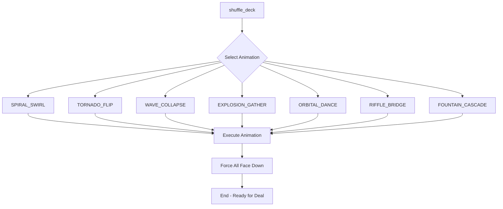

# Card Shuffle Animations

Moonridge Rummy features 7 beautiful card shuffle animations that play between rounds. Each animation is carefully crafted to provide visual variety and maintain player interest throughout the game.

## Overview

**File:** `playing_cards/card_shuffler.gd`

The `CardShuffler` class manages all shuffle animations using Godot's Tween system for smooth, performant animations. Cards are animated individually with staggered timing to create complex, flowing effects.

## Animation System Architecture



### Key Components

- **animation_duration**: Default 3.0 seconds (configurable)
- **Parallel Tweens**: All cards animate simultaneously with staggered delays
- **Card Flipping**: Cards flip to show faces mid-animation, then flip back
- **Z-Index Management**: Cards stack properly at the end
- **Position/Rotation/Scale**: All animated smoothly using tweens

## The 7 Shuffle Animations

### 1. SPIRAL_SWIRL 🌀

**Visual Effect:** Cards arranged in multiple spirals around the screen edges, then spiral inward while rotating, flipping twice during the journey.

**Phases:**
1. **Formation** (instant): Position cards in 3-6 spiral patterns around screen edges
2. **Inward Spiral** (80% of duration): Cards spiral toward center with rotation
3. **First Flip** (at 20%): Cards flip to show faces
4. **Second Flip** (at 40%): Cards flip back to face-down
5. **Stack Formation** (20% of duration): Cards settle into final stack position

**Technical Details:**
```gdscript
// Formation parameters
num_spirals: 3-6 (random)
radius: 60% of screen diagonal
card_scale: 2.0x (oversized)

// Animation
angle_delta: 4π (two full rotations)
ease: custom ease_in_out
```

**Use Case:** Creates a dramatic, hypnotic opening effect. Works great for the first round.

---

### 2. TORNADO_FLIP 🌪️

**Visual Effect:** Cards form a tornado/helix shape vertically on screen, flip twice in sequence, then collapse to stack.

**Phases:**
1. **Tornado Formation** (80% of duration): Cards arrange in vertical helix
   - Height: Bottom to top of screen
   - Radius: Large at bottom, tight at top
   - 8 complete spirals around the vertical axis
2. **Sequential Flips**: Cards flip in staggered sequence (bottom to top)
   - First flip at 30% duration
   - Second flip at later point (depends on card position)
3. **Collapse** (20% of duration): All cards collapse to stack position

**Technical Details:**
```gdscript
// Tornado parameters
height_range: [screen_height - 200, 200]
radius: lerp based on height_factor
spiral_turns: 8π
card_scale: 0.8x

// Timing
flip_duration: 0.6s
delay_factor: Staggered by card index
```

**Use Case:** Very dynamic, creates sense of upward movement and energy. Great for mid-game rounds.

---

### 3. WAVE_COLLAPSE 🌊

**Visual Effect:** Cards enter in 5 waves from different screen edges, gather in center, then collapse to stack.

**Phases:**
1. **Wave Positioning** (instant): Cards placed off-screen in 5 groups
   - Wave 0: Left edge
   - Wave 1: Top edge
   - Wave 2: Right edge
   - Wave 3: Bottom edge
   - Wave 4: Left edge (repeats)
2. **Wave Entry** (50% of duration): Waves sweep onto screen
   - Each wave delayed by 0.2s
   - Cards in wave have micro-delays (0.015s between cards)
3. **Center Gather**: Cards cluster near screen center with randomization
4. **Flip Sequence**: Cards flip twice during gather phase
5. **Collapse** (50% of duration): Smooth collapse to final stack

**Technical Details:**
```gdscript
// Wave parameters
num_waves: 5
cards_per_wave: ceil(total_cards / 5)
entry_positions: Randomized along edge

// Gathering
center_offset: ±200 horizontal, ±150 vertical
wave_spacing: 30 pixels vertical between waves
card_scale: 0.9x
```

**Use Case:** Creates a flowing, rhythmic effect. Good for establishing a calm, organized feeling.

---

### 4. EXPLOSION_GATHER 💥

**Visual Effect:** Cards start at center, explode outward in all directions, then get magnetically pulled back to stack.

**Phases:**
1. **Center Start** (instant): All cards at screen center, tiny scale (0.3x)
2. **Explosion** (35% of duration): Cards shoot outward
   - Random angles (0-360°)
   - Random distances (250-500 pixels)
   - Expand to 0.85x scale
   - Wild rotations (±1.5π)
   - Bounce easing for dramatic effect
3. **Pause** (0.3s): Brief moment at explosion peak
4. **Flip**: Cards flip during pause
5. **Magnetic Gather** (65% of duration): Cards pulled back to stack
   - Randomized delays (0-0.3s) for magnetic effect
   - Back-easing for "snapping into place" feel
   - Rotation normalizes
   - Scale returns to 1.0x

**Technical Details:**
```gdscript
// Explosion parameters
angle: random 0-2π
distance: random 250-500
rotation: random ±1.5π
ease: EASE_OUT, TRANS_BACK

// Gather
ease: EASE_IN, TRANS_BACK
delay: random 0-0.3s per card
```

**Use Case:** High energy, surprising. Great for keeping players engaged during longer games.

---

### 5. ORBITAL_DANCE 🪐

**Visual Effect:** Cards arrange into 4 concentric orbital rings, rotate in harmony, then spiral into center.

**Phases:**
1. **Random Start** (instant): Cards scattered randomly across screen (0.5x scale)
2. **Ring Formation** (30% of duration): Cards move into orbital positions
   - 4 concentric rings
   - Evenly spaced around each ring
   - Ring radii: 120, 190, 260, 330 pixels
3. **Orbital Dance** (40% of duration): Synchronized rotation
   - Each ring rotates at different speed (inner slower, outer faster)
   - Cards maintain orientation tangent to orbit
   - First flip at 30% of orbit phase
   - Second flip at 65% of orbit phase
4. **Spiral Convergence** (30% of duration): Cards spiral from orbits to stack
   - 3 complete spiral rotations
   - Custom ease_in_out for smooth convergence

**Technical Details:**
```gdscript
// Ring parameters
num_rings: 4
cards_per_ring: ceil(total_cards / 4)
base_radius: 120 pixels
ring_spacing: 70 pixels

// Orbit motion
orbit_speed: 1.0 + (ring_index * 0.3)
rotation_amount: 2π * orbit_speed
duration: 40% of animation

// Convergence
spiral_rotations: 3π
ease: custom ease_in_out
```

**Use Case:** Mesmerizing, geometric. Creates a sophisticated, elegant feel.

---

### 6. RIFFLE_BRIDGE 🎴

**Visual Effect:** Classic casino riffle shuffle - cards split into two halves, bridge up in an arc, interleave down.

**Phases:**
1. **Split** (instant): Cards divided into left and right halves
   - Left half: -300 pixels from center
   - Right half: +300 pixels from center
   - Slight vertical stagger (0.5 pixels per card)
2. **Bridge Motion** (40% of duration): Arc motion
   - Cards rise up in parabolic arc
   - Higher cards create taller arc
   - Peak height: -200 to -400 pixels (varies by position)
   - Cards rotate slightly outward during rise
3. **Interleave** (second half of bridge): Cards descend and interweave
   - Left and right halves alternate in z-order
   - Rotation returns to zero
   - Slight vertical offset in final position
4. **Flip**: Single flip at 40% of bridge duration
5. **Collapse** (60% of duration): Standard collapse to neat stack

**Technical Details:**
```gdscript
// Split parameters
left_offset: -300
right_offset: +300
card_stagger: 0.5 pixels vertical

// Bridge motion
bridge_height: -200 to -400 (based on card position)
rotation: ±0.15π (outward tilt)
motion: Custom bezier-like interpolation

// Timing
delay: 0.015s * card_position
```

**Use Case:** Familiar, professional. Gives a "real casino" feel.

---

### 7. FOUNTAIN_CASCADE ⛲

**Visual Effect:** Cards shoot upward from center like water fountain, reach peak, then cascade down to stack.

**Phases:**
1. **Fountain Base** (instant): Cards start slightly below center (0.8x scale)
2. **Launch** (50% of duration): Projectile motion upward
   - Launch angle: Random ±30° from vertical
   - Y velocity: Random -500 to -700 pixels/second
   - X velocity: Based on angle, ±300 range
   - Gravity: 1200 pixels/second²
   - Rotation: 2π during flight
3. **Flip**: Single flip at 30% of launch (at peak)
4. **Pause** (0.2s): Brief moment at peak of arc
5. **Cascade** (50% of duration): All cards fall to stack
   - Force face-down first
   - Standard collapse animation

**Technical Details:**
```gdscript
// Physics simulation
y_velocity: random -500 to -700
x_velocity: sin(angle) * 300
gravity: 1200
delta_time: progress * duration

// Motion equation
x = center_x + x_velocity * t + random_jitter
y = center_y + y_velocity * t + 0.5 * gravity * t²
rotation: 2π * progress

// Launch timing
delay: 0.02s * card_index (creates stream effect)
```

**Use Case:** Playful, fluid. Creates sense of celebration and movement.

---

## Animation Selection

### Manual Selection
```gdscript
await card_shuffler.shuffle_deck(CardShuffler.ShuffleType.SPIRAL_SWIRL)
```

### Random Selection
```gdscript
await card_shuffler.random_shuffle()
```

The game uses `random_shuffle()` to automatically vary animations between rounds, keeping the experience fresh.

## Technical Implementation

### Tween System

All animations use Godot's `Tween` class with parallel execution:

```gdscript
var tween = create_tween()
tween.set_parallel(true)  # All cards animate simultaneously

for i in range(cards.size()):
    var card = cards[i]
    var delay = i * delay_factor  # Stagger for visual effect
    
    tween.tween_property(card, "position", target_pos, duration).set_delay(delay)
    tween.tween_property(card, "rotation", target_rot, duration).set_delay(delay)
    tween.tween_callback(card.flip_card).set_delay(delay + flip_offset)

await tween.finished
```

### Card Flipping

Cards flip using their built-in `flip_card()` method:
- Flip is a separate animation on the card itself
- Takes `flip_duration` seconds (default 0.5s)
- Must account for flip duration when calculating delays

### Helper Functions

**`_calc_delay_factor()`**
Calculates delay between cards to ensure last card completes before phase ends:
```gdscript
func _calc_delay_factor(offset: float, phase_duration: float, card_flip_duration: float) -> float:
    var last_card_flip_offset = phase_duration - offset - card_flip_duration
    return last_card_flip_offset / (cards.size() - 1)
```

**`_ease_in_out()`**
Custom easing function for smooth acceleration/deceleration:
```gdscript
func _ease_in_out(t: float) -> float:
    return t * t * (3.0 - 2.0 * t)  # Smoothstep
```

**`_collapse_to_stack()`**
Standard ending sequence used by most animations:
- Randomized delays for organic feel
- Back-easing for "settling" effect
- Z-index animation for proper stacking
- Small position/rotation randomization

**`_spiral_converge_to_stack()`**
Specialized ending with spiral effect:
- Used by ORBITAL_DANCE
- 3 rotations while converging
- Custom easing

## Adding New Animations

To create a new shuffle animation:

1. **Add to enum:**
```gdscript
enum ShuffleType {
    // ... existing types
    MY_NEW_SHUFFLE,
}
```

2. **Add to match statement:**
```gdscript
match shuffle_type:
    // ... existing cases
    ShuffleType.MY_NEW_SHUFFLE:
        Global.dbg('shuffling with MY_NEW_SHUFFLE')
        await _my_new_shuffle()
```

3. **Implement the animation function:**
```gdscript
func _my_new_shuffle():
    # Phase 1: Initial positioning
    for i in range(cards.size()):
        var card = cards[i]
        card.force_face_down()
        card.position = # ... starting position
        card.rotation = # ... starting rotation
        card.scale = # ... starting scale
        card.z_index = i
    
    # Phase 2: Main animation
    var tween = create_tween()
    tween.set_parallel(true)
    
    for i in range(cards.size()):
        var card = cards[i]
        card.flip_duration = DEFAULT_CARD_FLIP_DURATION
        var delay = i * some_delay_factor
        
        # Animate properties
        tween.tween_property(card, "position", target, duration).set_delay(delay)
        tween.tween_callback(card.flip_card).set_delay(delay + flip_time)
    
    await tween.finished
    
    # Phase 3: Collapse to stack
    await _collapse_to_stack(remaining_duration)
```

4. **Add to random_shuffle list:**
```gdscript
func random_shuffle():
    var shuffle_types = [
        // ... existing types
        ShuffleType.MY_NEW_SHUFFLE,
    ]
```

### Animation Design Tips

1. **Use 2-3 distinct phases** for visual interest
2. **Stagger card animations** with small delays for organic feel
3. **Include at least one flip** so players see card faces briefly
4. **End with collapse_to_stack()** for consistency
5. **Use easing** for professional polish
6. **Test at different screen sizes** - use Global.screen_size and Global.screen_center
7. **Keep duration around 3 seconds** - shorter feels rushed, longer gets boring
8. **Vary scale** during animation for depth perception

### Performance Considerations

- **Parallel tweens are efficient** - Godot handles them well
- **Avoid per-frame callbacks** - use tween_property instead of tween_method when possible
- **Z-index changes are cheap** - don't worry about animating them
- **108 cards animate smoothly** - the system handles full deck well

## Configuration

### Export Variables
```gdscript
@export var animation_duration: float = 3.0  # Total animation time
@export var final_ending_card_rotation_delta: float = 0.0  # Final stack rotation
```

### Constants
```gdscript
const DEFAULT_CARD_FLIP_DURATION = 0.5  # Time for card flip animation
```

## Debugging

Enable debug output to see shuffle selection:
```gdscript
Global.dbg('shuffling with SPIRAL_SWIRL')
```

To test a specific animation during development:
```gdscript
# In StartRoundShuffleState or wherever shuffle is called
await card_shuffler.shuffle_deck(CardShuffler.ShuffleType.EXPLOSION_GATHER)
```

## Future Enhancements

Potential improvements:

- **Sound effects** for whooshes, flips, and card contact
- **Particle effects** for explosions and sparkles
- **Camera shake** for dramatic moments
- **Difficulty-based selection** - simpler animations early, complex later
- **Player preferences** - let players pick favorite or disable random
- **Combo animations** - chain multiple styles together
- **Theme variations** - holiday or special event shuffles

---

*Last Updated: October 2025*
