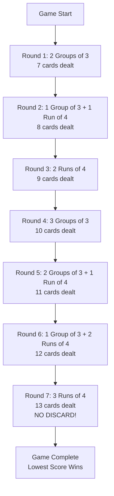
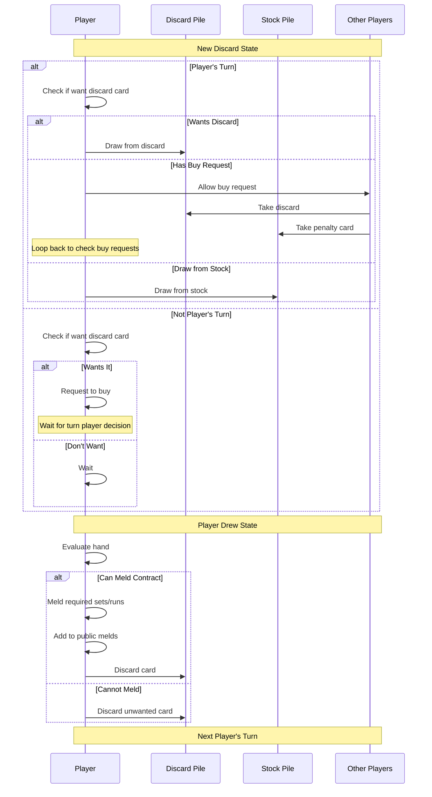
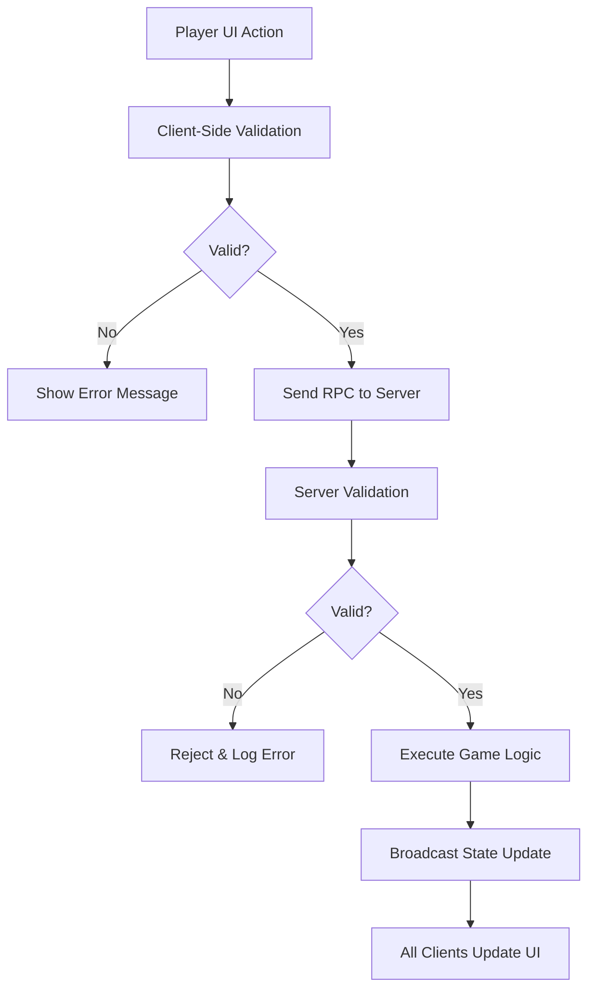

# Game Rules Implementation

This document explains how the Liverpool Rummy game rules are implemented in code. It bridges the gap between the conceptual rules in [rules.md](../rules.md) and their technical realization.

## Liverpool Rummy Rules Overview

Liverpool Rummy is played over **7 rounds**, each with specific meld requirements. Players must form valid groups (books) and runs (sequences) to win each round.

### Round Requirements



## Core Validation Functions

### Group (Book) Validation

**Location:** `global.gd::is_valid_group()`

A valid group consists of 3+ cards of the same rank.

**Rules:**
- Minimum 3 cards
- All non-joker cards must be same rank
- Jokers can substitute for any card
- Pure joker groups (3+ jokers) are valid

**Implementation:**
```gdscript
func is_valid_group(card_keys: Array) -> bool:
    if len(card_keys) < 3:
        return false
    
    var ranks = {}
    for card_key in card_keys:
        var rank = parts[0]
        if rank == 'JOKER':
            continue  # Jokers don't count toward rank diversity
        ranks[rank] = true
    
    return len(ranks) <= 1  # All non-jokers must be same rank
```

**Examples:**
```
✓ Valid:   7♥, 7♣, 7♦
✓ Valid:   K♠, K♥, K♦, K♣
✓ Valid:   A♥, JOKER, A♣
✓ Valid:   JOKER, JOKER, JOKER
✗ Invalid: 7♥, 8♥, 9♥ (different ranks)
✗ Invalid: K♠, K♥ (only 2 cards)
```

### Run (Sequence) Validation

**Location:** `global.gd::is_valid_run()`

A valid run consists of 4+ consecutive cards of the same suit.

**Rules:**
- Minimum 4 cards
- All regular cards must be same suit (checked implicitly via gameplay)
- Cards must be consecutive in rank
- Jokers can fill gaps
- Aces can be low (A-2-3-4) or high (J-Q-K-A) but not both
- Runs cannot wrap (K-A-2-3 is invalid)

**Implementation:**
```gdscript
func is_valid_run(card_keys: Array) -> bool:
    if len(card_keys) < 4:
        return false
    
    # Separate jokers from regular cards
    var regular_cards = []
    var num_jokers = 0
    var has_ace = false
    
    for card_key in card_keys:
        if rank == 'JOKER':
            num_jokers += 1
        else:
            regular_cards.append(value)
            if value == 14:  # Ace
                has_ace = true
    
    # Calculate gaps with ace as low and high
    var min_gaps = 999
    if has_ace:
        # Try ace as 1 (low)
        var gaps_low = calculate_gaps(cards_with_ace_as_1)
        # Try ace as 14 (high)  
        var gaps_high = calculate_gaps(cards_with_ace_as_14)
        min_gaps = min(gaps_low, gaps_high)
    else:
        min_gaps = calculate_gaps(regular_cards)
    
    # Jokers must fill all gaps
    return num_jokers >= min_gaps
```

**Gap Calculation:**
```gdscript
// For sorted cards: [2, 4, 5, 8]
// Gaps: 4-2-1=1, 5-4-1=0, 8-5-1=2
// Total gaps: 3
// Need 3 jokers to fill: [2, 3J, 4, 5, 6J, 7J, 8]
```

**Examples:**
```
✓ Valid:   2♥, 3♥, 4♥, 5♥
✓ Valid:   10♣, J♣, Q♣, K♣, A♣ (ace high)
✓ Valid:   A♦, 2♦, 3♦, 4♦ (ace low)
✓ Valid:   2♠, JOKER, 4♠, 5♠ (joker fills 3♠)
✓ Valid:   7♥, 8♥, 9♥, 10♥, J♥, Q♥ (6 cards)
✗ Invalid: 2♥, 3♥, 4♥ (only 3 cards)
✗ Invalid: 2♥, 4♥, 6♥, 8♥ (gaps too large, would need 3 jokers)
✗ Invalid: K♣, A♣, 2♣, 3♣ (wrapping not allowed)
```

## Scoring System

### Card Point Values

**Location:** `global.gd::card_key_score()`

```gdscript
func card_key_score(card_key: String) -> int:
    var rank = card_key.split('-')[0]
    match rank:
        'JOKER': return 15
        'A':     return 15
        'K':     return 10
        'Q':     return 10
        'J':     return 10
        '10':    return 10
        _:       return 5  # 2-9 worth 5 points each
```

**Point Values Table:**

| Card | Points | Notes |
|------|--------|-------|
| Joker | 15 | Most valuable |
| Ace | 15 | Same as Joker |
| K, Q, J, 10 | 10 | Face cards |
| 2-9 | 5 | Number cards |

### Hand Scoring

**Location:** `global.gd::tally_hand_cards_score()`

```gdscript
func tally_hand_cards_score(card_keys_in_hand: Array) -> int:
    var score = 0
    for card_key in card_keys_in_hand:
        score += card_key_score(card_key)
    return score
```

**Scoring Rules:**
- **During Round:** Cards remaining in hand at round end count as penalty points
- **Winner:** Player who goes out scores 0 for that round
- **Game End:** Lowest total score across all rounds wins

**Example Scoring:**
```
Player has at round end: K♠, 7♥, 3♣
Points: 10 + 5 + 5 = 20 penalty points

Player melded everything and went out:
Points: 0 (wins the round!)
```

## Turn Mechanics

### Turn Flow



### Draw Phase Rules

**1. Player Turn Options:**
- Draw from **discard pile** (take visible top card)
- Draw from **stock pile** (take face-down top card)
- **Allow buy request** from another player (if pending)

**2. Non-Turn Player Options:**
- **Request to buy** discard pile card (must wait for turn player decision)
- **Wait** for turn to come around

**3. Buy Request Mechanics:**

When a player requests to buy:
1. Request registered with server
2. Turn player decides: allow or take card themselves
3. If allowed:
   - Buying player gets discard card
   - Buying player gets **penalty card** from stock pile
   - Turn player draws again from their choice
4. Grace period: Other players have ~3-10 seconds to request buy

**Location:** `global.gd::allow_player_to_buy_card_from_discard_pile()`

```gdscript
func allow_player_to_buy_card_from_discard_pile(buying_player_id: String):
    # Give discard card to buyer
    _rpc_give_top_discard_pile_card_to_player.rpc(buying_player_id)
    # Give penalty card from stock
    deal_penalty_card_to_player(buying_player_id)
```

## Melding Rules

### Personal Melding (First Meld)

**Requirements:**
- Must meet exact round contract
- All required groups/runs laid down simultaneously
- After personal meld, can add to any player's melds

**Round Contracts:**
```gdscript
// In player.gd and global.gd
var current_round = Global.game_state.current_round_num

match current_round:
    1: requires 2 groups of 3
    2: requires 1 group of 3 + 1 run of 4
    3: requires 2 runs of 4
    4: requires 3 groups of 3
    5: requires 2 groups of 3 + 1 run of 4
    6: requires 1 group of 3 + 2 runs of 4
    7: requires 3 runs of 4 (NO DISCARD!)
```

**Validation Check:**
```gdscript
// Each meld area validated independently
meld_area_1_is_complete = Global.is_valid_group(meld_area_1_keys)
meld_area_2_is_complete = Global.is_valid_run(meld_area_2_keys)

// All required melds must be valid
can_meld = meld_area_1_is_complete and meld_area_2_is_complete
```

### Public Melding (Post-First-Meld)

After personal meld complete, players can add cards to ANY player's melds:

**Adding to Groups:**
- Add matching rank card to any group
- Example: Add 7♠ to opponent's 7♥, 7♣, 7♦

**Adding to Runs:**
- Extend run at either end
- Example: Add 6♥ to 7♥, 8♥, 9♥, 10♥ → 6♥, 7♥, 8♥, 9♥, 10♥

**Replacing Jokers in Runs:**
- Replace joker with actual card
- Example: Replace JOKER in 5♣, JOKER, 7♣, 8♣ with 6♣
- Player gets joker back (in some rule variants)

## Special Round 7 Rules

Round 7 has unique mechanics:

**Requirements:**
- Must meld 3 runs of 4 cards
- Uses all 13 cards dealt
- **NO DISCARD ALLOWED**
- Must go out by melding entire hand

**Implementation:**
```gdscript
var current_round = Global.game_state.current_round_num

if current_round == 7:
    # Player must meld all cards with no remaining cards
    var has_cards_left = len(card_keys_in_hand) > 0
    if has_cards_left:
        cannot_go_out()  # Still have cards after melding
    else:
        player_wins_round()  # Perfect meld!
else:
    # Rounds 1-6: Must discard exactly 1 card
    if len(card_keys_in_hand) == 1:
        must_discard_last_card()
        player_wins_round()
```

## Joker Rules

Jokers are wild cards with special rules:

### General Joker Rules
1. **Substitution:** Can represent any card
2. **Groups:** Can be part of any group
3. **Runs:** Must maintain sequential order
4. **Value:** Worth 15 points (highest penalty)
5. **Pure Joker Melds:** 3+ jokers can form valid group or run (4+ for runs)

### Joker Limitations

**Cannot Fill Multiple Gaps:**
```
✗ Invalid: 2♥, JOKER, 5♥, 6♥
// Joker can't be both 3♥ and 4♥

✓ Valid: 2♥, 3♥, JOKER, 5♥, 6♥
// Joker fills single gap as 4♥
```

**Must Maintain Suit in Runs:**
```
✗ Invalid: 2♥, 3♦, JOKER, 5♥
// Different suits (even with joker)

✓ Valid: 2♥, 3♥, JOKER, 5♥
// All hearts, joker fills 4♥
```

## Ace Rules

Aces have flexible positioning:

### Low Ace (Value = 1)
```
✓ A-2-3-4 of hearts
✓ A-2-3-4-5 of spades
```

### High Ace (Value = 14)
```
✓ J-Q-K-A of clubs
✓ 10-J-Q-K-A of diamonds
```

### Invalid Wrapping
```
✗ K-A-2-3 (wraps around)
✗ Q-K-A-2-3 (wraps around)
```

**Implementation:**
```gdscript
// Ace can have value 1 or 14
var ace_value = 14  // Default
if in_low_sequence:
    ace_value = 1

// Run validation tries both interpretations
if has_ace:
    gaps_low = calc_gaps_with_ace_as_1()
    gaps_high = calc_gaps_with_ace_as_14()
    min_gaps = min(gaps_low, gaps_high)
```

## Game State Validation

### Win Condition Checks

**Regular Rounds (1-6):**
```gdscript
func can_win_round() -> bool:
    var has_melded = player_has_melded(player_id)
    var cards_remaining = len(card_keys_in_hand)
    return has_melded and cards_remaining == 1  # Must discard last card
```

**Round 7:**
```gdscript
func can_win_round_7() -> bool:
    var has_melded_all = player_has_melded(player_id)
    var cards_remaining = len(card_keys_in_hand)
    return has_melded_all and cards_remaining == 0  # No cards left!
```

### Turn Validation

**Location:** `global.gd::validate_current_player_turn()`

```gdscript
func validate_current_player_turn(player_id: String):
    var player_info = find_player(player_id)
    if player_info.turn_index != game_state.current_player_turn_index:
        return null  // Not this player's turn
    return player_info
```

Only current turn player can:
- Draw cards
- Discard cards
- Meld cards
- Allow buy requests

Non-turn players can only:
- Request to buy discard card
- View public game state

## Edge Cases & Special Scenarios

### Empty Deck Handling
```gdscript
if len(stock_pile) == 0:
    // Reshuffle discard pile (minus top card) into stock
    reshuffle_discard_into_stock()
```

### Simultaneous Buy Requests
```gdscript
// Multiple players request to buy
// First request processed wins
// Others notified request denied
game_state.current_buy_request_player_ids = {}
```

### Player Disconnection
```gdscript
// If player disconnects:
// - Bot can take over (if implemented)
// - Hand remains frozen
// - Turn skips disconnected player
```

### Invalid Meld Attempts
```gdscript
// UI validates before allowing meld
// Server double-checks meld validity
// Invalid melds rejected with error
if not is_valid_meld():
    error("Invalid meld attempt")
    return
```

## Testing Rules Implementation

### Unit Tests

**Location:** `tests/test_bots.gd::test_is_valid_run()`

```gdscript
func test_is_valid_run():
    # Test basic run
    assert_true(Global.is_valid_run(["A-hearts-0", "2-hearts-0", "3-hearts-0", "4-hearts-0"]))
    
    # Test with joker filling gap
    assert_true(Global.is_valid_run(["2-hearts-0", "3-hearts-0", "JOKER-1-0", "5-hearts-0", "6-hearts-0"]))
    
    # Test invalid: too many gaps
    assert_false(Global.is_valid_run(["2-hearts-0", "3-hearts-0", "JOKER-1-0", "6-hearts-0", "7-hearts-0"]))
```

### Integration Tests

Test complete game scenarios:
- Full round play-through
- Multiple buy requests
- Round 7 no-discard win
- Joker replacement
- Public melding after personal meld

## Rule Enforcement Architecture



**Two-Layer Validation:**

1. **Client-Side** (UI prevention):
   - Real-time feedback
   - Prevent invalid moves before RPC
   - Visual indicators (green/red borders)

2. **Server-Side** (authority):
   - Final validation
   - Prevents cheating
   - Source of truth

## Configuration & Constants

**Location:** `global.gd`

```gdscript
// Grace period for buy requests
const OTHER_PLAYER_BUY_GRACE_PERIOD_SECONDS: float = 3.0

// Card point values
const JOKER_POINTS = 15
const ACE_POINTS = 15
const FACE_CARD_POINTS = 10
const NUMBER_CARD_POINTS = 5

// Deck configuration
const NUM_DECKS = 2
const CARDS_PER_SUIT = 13
const NUM_JOKERS_PER_DECK = 2
```

## Summary

The game rules are enforced through:

1. **Validation Functions** - `is_valid_group()`, `is_valid_run()`
2. **Turn Management** - State machine controls turn flow
3. **Scoring System** - Point calculation for penalty cards
4. **Buy Mechanics** - Request/allow system with penalty cards
5. **Meld Tracking** - Personal vs public melding phases
6. **Round Requirements** - Specific contracts per round
7. **Special Cases** - Round 7, jokers, aces, wrapping

All rules are enforced both client-side (for UX) and server-side (for authority), ensuring fair play and preventing cheating in multiplayer games.

---

*Last Updated: October 2025*
