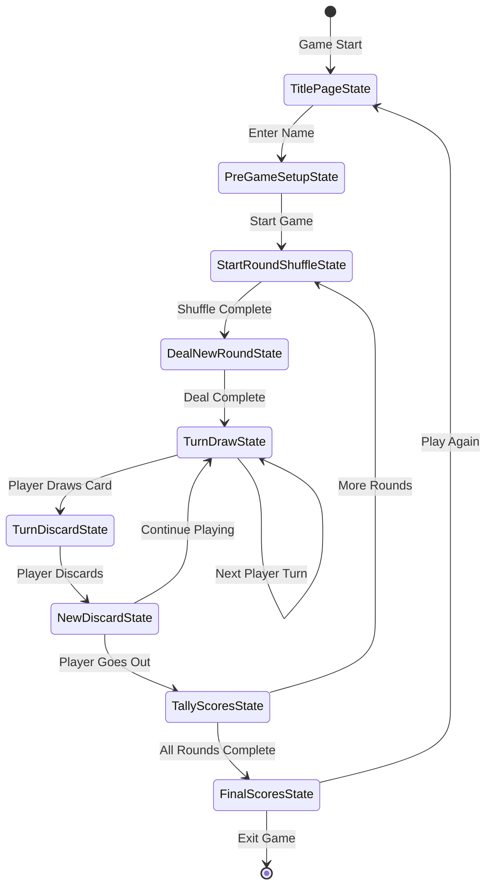

# Game State Machine

Liverpool Rummy uses a finite state machine to manage the game flow. Each state handles a specific phase of the game and transitions to the next state when its work is complete.

## State Flow Overview



## State Descriptions

### 1. TitlePageState
**File:** `state_machine/01-title_page_state.gd`

Initial state shown when game launches.
- Displays splash screen and version
- Handles language selection (English/German)
- Transitions to PreGameSetupState

### 2. PreGameSetupState
**File:** `state_machine/02-pre_game_setup_state.gd`

Player setup and multiplayer connection.
- Player enters their name
- UDP discovery for finding hosts
- Host/Join game selection
- Bot player addition
- Waits for "Start Game" (requires 2+ players)

**Multiplayer Details:** See [Multiplayer Architecture](multiplayer-architecture.md)

### 3. StartRoundShuffleState
**File:** `state_machine/03-start_round_shuffle_state.gd`

Card shuffling animation phase.
- Displays current round information
- Performs shuffle animation (7 different styles available)
- Prepares deck for dealing
- Duration: ~3 seconds

**Animation Details:** See `playing_cards/card_shuffler.gd` for shuffle implementations

### 4. DealNewRoundState
**File:** `state_machine/04-deal_new_round_state.gd`

Deals cards to all players for the new round.
- Deals appropriate number of cards per round (7-13 cards initially)
- Players may gain more cards during the round by buying
- Animates card movement from deck to hands
- Establishes initial discard pile
- Only server/host performs dealing, clients receive via RPC

### 5. TurnDrawState
**File:** `state_machine/05-turn_draw_state.gd`

Player draws a card at start of their turn.
- Highlights current player
- Allows draw from stock pile or discard pile
- Handles "buy" requests from other players
- Validates legal draws
- Advances to TurnDiscardState after draw

**Turn Order:**
- Cycles through all non-bot players
- Bots take turns automatically
- Dead players are skipped

### 6. TurnDiscardState
**File:** `state_machine/06-turn_discard_state.gd`

Player arranges their hand and discards.
- Player organizes cards into meld areas
- Validates melds meet round requirements
- Player selects card to discard
- Checks for winning hand

**If player goes out:** → TallyScoresState  
**Otherwise:** → NewDiscardState

### 7. NewDiscardState
**File:** `state_machine/06-new_discard_state.gd`

Processes the discard and prepares for next turn.
- Animates discard to discard pile
- Updates game state
- Checks if any player went out

**Transitions:**
- → TallyScoresState if player won
- → TurnDrawState for next player's turn

### 8. TallyScoresState
**File:** `state_machine/09-tally-scores_state.gd`

Calculates and displays round scores.
- Awards points for melded cards
- Penalizes unmeld cards remaining in hands
- Updates cumulative scores
- Displays round summary

**Transitions:**
- → StartRoundShuffleState if more rounds remain
- → FinalScoresState if all 7 rounds complete

### 9. FinalScoresState
**File:** `state_machine/10-final-scores_state.gd`

Displays final game results.
- Shows all player scores
- Declares winner (lowest score)
- Offers "Play Again" option

**Transitions:**
- → TitlePageState to start new game
- Exit application

## State Machine Implementation

The game uses Godot's built-in state machine pattern:

**File:** `state_machine/game_state_machine.gd` (if exists) or managed via scene tree

Each state is a separate scene with a corresponding script that extends a base state class or Node.

### State Interface

Each state typically implements:
```gdscript
func enter_state():
    # Called when entering this state
    # Initialize UI, start animations, etc.

func exit_state():
    # Called when leaving this state
    # Cleanup, save state, etc.

func transition_to(next_state: String):
    # Request transition to next state
    emit_signal("state_transition", next_state)
```

## Round Progression

Liverpool Rummy has 7 rounds with different meld requirements:

| Round | Cards Initially Dealt | Required Melds |
|-------|----------------------|----------------|
| 1     | 7           | 2 groups of 3 |
| 2     | 8           | 1 group of 3 + 1 run of 4 |
| 3     | 9           | 2 runs of 4 |
| 4     | 10          | 3 groups of 3 |
| 5     | 11          | 2 groups of 3 + 1 run of 4 |
| 6     | 12          | 1 group of 3 + 2 runs of 4 |
| 7     | 13          | 3 runs of 4 (must meld ALL cards in hand) |

**Note:** Players may have more cards than initially dealt if they bought from the discard pile during the round. Each buy adds 2 cards (discard + penalty).

Round requirements are enforced in **TurnDiscardState** when validating melds.

## State Persistence

Game state is maintained in `global.gd`:
- `Global.game_state` - Public game state (visible to all players)
- `Global.private_player_info` - Local player's private info
- `Global.bots_private_player_info` - Bot private info (host only)

State is synchronized across multiplayer clients using RPCs.

## Error Recovery

If a state encounters an error:
1. Log error via `Global.error()`
2. Attempt to recover to a safe state
3. If unrecoverable, transition back to TitlePageState

---

*Last Updated: October 2025*
