# Meld Validation and Scoring System

This document provides a comprehensive overview of how melding and scoring work in Moonridge Rummy, from validation algorithms to final score calculation and presentation.

## Overview

The scoring system has two main components:
1. **Meld Validation** - Ensuring players meet round requirements
2. **Score Calculation** - Tallying penalty points for unmeld cards

**Key Principle:** Lower score wins! Points are penalties for cards left in hand.

## Meld Validation System

### Pre-Meld Phase (Before First Meld)

Players must meet exact round requirements before making their first meld.


### Round-by-Round Validation

**File:** `scripts/meld_area_visual.gd::_is_meld_satisfied()`

```gdscript
func _is_meld_satisfied(card_keys: Array) -> bool:
    var round_num = Global.game_state.current_round_num
    match round_num:
        1:  # 2 Groups of 3
            area_1: is_valid_group(keys)  // Must be group
            area_2: is_valid_group(keys)  // Must be group
            area_3: true                   // Not used
        
        2:  # 1 Group + 1 Run
            area_1: is_valid_group(keys)  // Must be group
            area_2: is_valid_run(keys)    // Must be run
            area_3: true                   // Not used
        
        3:  # 2 Runs
            area_1: is_valid_run(keys)    // Must be run
            area_2: is_valid_run(keys)    // Must be run
            area_3: true                   // Not used
        
        4:  # 3 Groups
            area_1: is_valid_group(keys)  // Must be group
            area_2: is_valid_group(keys)  // Must be group
            area_3: is_valid_group(keys)  // Must be group
        
        5:  # 2 Groups + 1 Run
            area_1: is_valid_group(keys)  // Must be group
            area_2: is_valid_group(keys)  // Must be group
            area_3: is_valid_run(keys)    // Must be run
        
        6:  # 1 Group + 2 Runs
            area_1: is_valid_group(keys)  // Must be group
            area_2: is_valid_run(keys)    // Must be run
            area_3: is_valid_run(keys)    // Must be run
        
        7:  # 3 Runs
            area_1: is_valid_run(keys)    // Must be run
            area_2: is_valid_run(keys)    // Must be run
            area_3: is_valid_run(keys)    // Must be run
```

### Validation Requirements

**Minimum Cards per Meld:**
- **Groups:** 3 cards minimum
- **Runs:** 4 cards minimum

**Maximum Cards per Meld:**
- No maximum! Groups and runs can be any length
- Example: 7♥, 7♣, 7♦, 7♠ is a valid 4-card group
- Example: A♠, 2♠, 3♠, 4♠, 5♠, 6♠ is a valid 6-card run

**Flexibility:**
- Players decide how to organize cards
- Can use more cards than minimum requirement
- Can keep cards in hand for later discard

### Post-Meld Phase (After First Meld)

After personal meld complete, players can add individual cards to ANY player's melds.

**Public Melding Validation:**


**Examples:**

Adding to Groups:
```
Existing Group: 7♥, 7♣, 7♦
Can Add: 7♠ ✓
Cannot Add: 8♠ ✗ (different rank)
```

Extending Runs:
```
Existing Run: 5♣, 6♣, 7♣, 8♣
Can Add Front: 4♣ ✓
Can Add Back: 9♣ ✓
Cannot Add: 3♣ ✗ (creates gap)
```

Replacing Jokers:
```
Existing Run: 5♥, JOKER, 7♥, 8♥
Can Replace: 6♥ ✓ (replaces JOKER)
Cannot Replace: 9♥ ✗ (doesn't match joker position)
```

## Scoring System Architecture

### Score Calculation Flow

```mermaid
flowchart LR
    RoundEnd[Round Ends<br/>Player Went Out] --> TallyPhase[Enter TallyScoresState]
    
    TallyPhase --> Server{Is Server?}
    Server -->|Yes| CalcBots[Calculate Bot Scores]
    CalcBots --> Broadcast1[Broadcast Bot Scores]
    
    Server -->|No| WaitBots[Wait for Bot Scores]
    
    Broadcast1 --> CalcLocal[Calculate Local Player Score]
    WaitBots --> CalcLocal
    
    CalcLocal --> AnimateCards[Animate Cards to Center<br/>Show Individual Values]
    AnimateCards --> AnimateToPlayer[Animate to Player Position<br/>Show Round Total]
    AnimateToPlayer --> UpdateTotal[Update Cumulative Total]
    UpdateTotal --> CheckRounds{All 7 Rounds<br/>Complete?}
    
    CheckRounds -->|No| NextRound[Wait for Host Click<br/>→ Next Round]
    CheckRounds -->|Yes| FinalScores[→ FinalScoresState]
```



### Card Point Values

**Location:** `global.gd::card_key_score()`

| Card Type | Cards | Points | Strategy |
|-----------|-------|--------|----------|
| **Jokers** | JOKER-1, JOKER-2 | **15** | Never discard! Always use in melds |
| **Aces** | A♥ A♦ A♣ A♠ | **15** | High penalty, meld or discard early |
| **Face Cards** | K, Q, J | **10** | Medium penalty, useful in runs |
| **Tens** | 10 | **10** | Medium penalty, useful in runs |
| **Number Cards** | 2-9 | **5** | Low penalty, safe to hold |

**Implementation:**
```gdscript
func card_key_score(card_key: String) -> int:
    var rank = card_key.split('-')[0]
    match rank:
        'JOKER': return 15
        'A':     return 15
        'K', 'Q', 'J', '10': return 10
        _:       return 5
```

### Hand Tallying

**Location:** `global.gd::tally_hand_cards_score()`

```gdscript
func tally_hand_cards_score(card_keys_in_hand: Array) -> int:
    var score = 0
    for card_key in card_keys_in_hand:
        score += card_key_score(card_key)
    return score
```

**What Counts:**
- ✓ Cards still in hand at round end
- ✗ Cards in meld areas (don't count if melded)
- ✗ Cards melded to table (personal or public melds)

**Example:**
```
Player's Hand at Round End:
- In Hand: K♠ (10), 7♥ (5), 3♣ (5)
- In Meld Area 1: 8♥, 8♣, 8♦ (would be melded)
- On Table: A♥, 2♥, 3♥, 4♥ (already melded)

If player went out:
  Score = 0 (winner!)

If player did NOT go out:
  Score = 10 + 5 + 5 = 20 penalty points
  (Meld area cards don't count if they weren't melded)
```

## Round Score Calculation

### Winner Score

**Player Who Went Out:**
```gdscript
round_score = 0  // No penalty
total_score += 0
```

### Other Players

**Players Who Didn't Go Out:**
```gdscript
// Tally all cards in hand
round_score = sum(card_points for card in hand)

// Add to cumulative total
total_score += round_score
```

**Important:** Cards in meld areas that were never melded count as penalties!

### Score Animation

**File:** `state_machine/09-tally-scores_state.gd`

**For Each Player:**
1. Each card in hand animates to screen center
2. Card's point value displays (+5, +10, +15)
3. Card moves to player's area
4. Final round score displays (+XX)
5. Cumulative total updates

**Timing:**
- 0.3 seconds pause per card at center
- Speed based on `Global.deal_speed_pixels_per_second`
- Staggered for dramatic effect

### Score Tracking

**Data Structure:**
```gdscript
// In Global.game_state.public_players_info
{
    'id': 'player_123',
    'name': 'Alice',
    'turn_index': 0,
    'score': 145,  // Cumulative total across all rounds
    'played_to_table': [...]  // Current melds
}

// In Global.private_player_info
{
    'score': 145,  // Cumulative total
    'card_keys_in_hand': [...]  // Current hand
}
```

**Score Updates:**
- Round-by-round cumulative
- Broadcast via RPC to all players
- Stored in both public (for display) and private (for local player)

## Final Score Presentation

### Winner Determination

**File:** `state_machine/10-final-scores_state.gd::sort_winning_players_by_score()`

```gdscript
// Sort players by total score (ascending)
sorted_players.sort_by_score()

// Handle ties - players with same score rank equally
1st place: Player(s) with lowest score
2nd place: Player(s) with next lowest score
3rd place: Player(s) with next lowest score
Remaining: All other players
```

**Tie Handling:**
```
Example Scores:
- Alice: 85
- Bob: 85
- Carol: 120
- Dave: 150

Result:
1st place: Alice, Bob (tied at 85)
2nd place: Carol (120)
3rd place: Dave (150)
```

### Trophy Presentation

**Animated Trophy Ceremony:**


**Trophy Positions:**
```
Screen Layout (Y-axis percentages):

20% - 🏆 1st Place (Gold) + Winner(s)
40% - 🥈 2nd Place (Silver) + Winner(s)
60% - 🥉 3rd Place (Bronze) + Winner(s)
85% - 4th+ Place Players (side by side)
```

### Confetti & Celebration

**Continuous Animation:**
- Confetti explosions every 5 seconds
- Multiple bursts of 5000 particles
- Continues until host clicks to restart
- Positive, celebratory atmosphere

## Detailed Meld Validation Algorithms

### Group Validation Deep Dive

**File:** `global.gd::is_valid_group()`

**Algorithm:**
```gdscript
1. Check minimum count (>= 3 cards)
2. Extract ranks from all cards
3. Ignore jokers
4. Count unique ranks among regular cards
5. Valid if <= 1 unique rank (all same rank or all jokers)
```

**Edge Cases:**
```
All Jokers: JOKER, JOKER, JOKER
  ✓ Valid (1 unique "rank" if you count jokers separately)

All Same Rank: K♥, K♣, K♦, K♠
  ✓ Valid (1 unique rank: K)

Mixed with Joker: 7♠, JOKER, 7♥
  ✓ Valid (1 unique rank: 7)

Two Different Ranks: 7♠, 8♥, JOKER
  ✗ Invalid (2 unique ranks: 7, 8)
```

### Run Validation Deep Dive

**File:** `global.gd::is_valid_run()`

**Algorithm:**
```gdscript
1. Check minimum count (>= 4 cards)
2. Separate jokers from regular cards
3. Extract numeric values (A=1 or 14, 2-10=face value, J=11, Q=12, K=13)
4. If has Ace:
   a. Try as low (value=1)
   b. Calculate gaps
   c. Try as high (value=14)
   d. Calculate gaps
   e. Use minimum gaps
5. Else:
   a. Calculate gaps in sequence
6. Valid if num_jokers >= gaps
```

**Gap Calculation:**
```
Example: 2, 5, 7, 9 (values)
Sorted: [2, 5, 7, 9]
Gaps:
  5-2-1 = 2 (missing 3, 4)
  7-5-1 = 1 (missing 6)
  9-7-1 = 1 (missing 8)
Total gaps: 4

Need 4 jokers to fill:
  2, 3J, 4J, 5, 6J, 7, 8J, 9
```

**Ace Dual-Value Logic:**
```
Low Ace Example:
  Cards: A, 2, 3, 4 (all hearts)
  Values: [1, 2, 3, 4]
  Gaps: 0
  ✓ Valid run

High Ace Example:
  Cards: J, Q, K, A (all clubs)
  Values: [11, 12, 13, 14]
  Gaps: 0
  ✓ Valid run

Invalid Wrap:
  Cards: K, A, 2, 3 (all diamonds)
  Try low: [13, 1, 2, 3] → gaps from 13→1 = 11
  Try high: [13, 14, 2, 3] → gaps from 14→2 = 11
  Need 11 jokers!
  ✗ Invalid (even with jokers)
```

## Personal Melding Process

### Evaluation Structure

**File:** `players/player.gd::_evaluate_player_hand_pre_meld()`

**Returned Dictionary:**
```gdscript
{
    'can_be_personally_melded': [
        {
            'type': 'group',
            'card_keys': ['7-hearts-0', '7-clubs-0', '7-diamonds-0']
        },
        {
            'type': 'run',
            'card_keys': ['2-spades-0', '3-spades-0', '4-spades-0', '5-spades-0']
        }
    ],
    'can_be_publicly_melded': [],  // Empty before first meld
    'recommended_discards': ['K-hearts-0', '9-diamonds-0'],
    'eval_score': 2195,
    'is_winning_hand': true
}
```

### Meld Execution

**When Player Clicks to Meld:**


**What Happens:**
1. Cards from meld areas moved to `played_to_table`
2. Cards removed from hand
3. Meld areas cleared
4. Player can now publicly meld
5. Visual indicators update

## Public Melding Process

### Finding Public Meld Opportunities

**File:** `players/00-bot.gd` (used by both bots and players)

**For Groups:**
```gdscript
func _find_groups_can_be_publicly_melded():
    for each rank in hand:
        if rank exists in any_public_meld:
            if public_meld.type == 'group':
                → Can add card to that group
```

**For Runs:**
```gdscript
func _find_runs_can_be_publicly_melded():
    for each suit in hand:
        for each public_run of same_suit:
            if can_extend_run(card, public_run):
                → Can add to front or back
            if can_replace_joker(card, public_run):
                → Can replace joker in run
```

### Public Meld Data Structure

```gdscript
'can_be_publicly_melded': [
    {
        'card_key': '7-spades-0',
        'target_player_id': 'player_456',
        'meld_group_index': 0,
        'can_extend': false,
        'can_replace_joker': false
    },
    {
        'card_key': '9-hearts-0',
        'target_player_id': 'bot1',
        'meld_group_index': 1,
        'can_extend': true,  // Extends run
        'can_replace_joker': false
    }
]
```

## Score Display Components

### Round Score Display

**File:** `scenes/transient_round_score.tscn`

**Visual Elements:**
- Large label showing "+XX"
- Positioned over player area
- Visible only during TallyScoresState
- Temporary - freed after state exit

### Per-Card Score Animation

During tally:
1. Card moves to center
2. Label appears: "+5", "+10", or "+15"
3. Pauses briefly (0.3s)
4. Moves to player position with label
5. Card hides, label shows round total

### Total Score Tracking

**Displayed Locations:**
- Player info panel
- Round score overlay
- Final scores screen

**Update Timing:**
- After each round completion
- Synchronized across all clients via RPC
- Server is authority for all scores

## Winning Conditions by Round

### Rounds 1-6

**Requirements:**
1. Personal meld complete (all required sets/runs)
2. All cards melded except one
3. Discard final card

**Validation:**
```gdscript
is_winning = (
    has_melded and 
    cards_in_hand.size() == 1 and
    discarding_last_card
)
```

### Round 7

**Requirements:**
1. Personal meld complete (3 runs of 4+)
2. ALL cards in hand melded to table
3. Zero cards remaining (no discard!)

**Validation:**
```gdscript
is_winning = (
    has_melded and 
    cards_in_hand.size() == 0
)

// Remember: player may have 13, 15, 17+ cards
// if they bought during the round
```

**Special Consideration:**
- More challenging if player bought cards
- Each buy adds 2 cards that must be melded
- Strategic decision: buy vs keep hand size manageable

## Score Optimization Strategies

### For Players

**Early Game (Rounds 1-3):**
- Discard high-value cards (Aces, face cards) early
- Keep low-value cards (2-5) for flexibility
- Don't hoard jokers if you can meld them

**Mid Game (Rounds 4-5):**
- Balance between going out and low penalty
- Consider public melding opportunities
- Strategic buying if it completes melds

**Late Game (Rounds 6-7):**
- Focus on going out
- Use all jokers optimally
- Minimize cards in hand
- Be cautious with buying (harder to meld more cards)

### For Bots

**BasicBot Strategy:**
```gdscript
eval_score = (publicly_meldable * 100) - penalty_points + (is_winning * 1000)

// Prioritizes:
1. Winning hand (+1000 bonus)
2. Cards that can be publicly melded (+100 each)
3. Minimizing penalty card points
```

**Discard Priority:**
- Highest-value unmeldable cards first
- Keep cards with meld potential
- Never discard jokers
- Never discard last drawn from discard pile

## Meld Validation Edge Cases

### Insufficient Cards

```
Round 2 requires: 1 group of 3 + 1 run of 4 (7 cards)
Player has: Only 2♥, 2♣ (2 cards in meld area 1)

Result: ✗ Invalid (group needs 3 minimum)
Meld area shows: neutral border, no sparkle
Cannot meld hand yet
```

### Excess Cards in Melds

```
Round 1 requires: 2 groups of 3
Player puts in meld area 1: 7♥, 7♣, 7♦, 7♠ (4 cards)
Player puts in meld area 2: K♠, K♥, K♦ (3 cards)

Result: ✓ Valid! (4-card group is fine, exceeds minimum)
Both areas sparkle
Can meld hand
```

### Mixed Valid/Invalid

```
Round 2 requires: 1 group + 1 run
Meld Area 1: 8♥, 8♣, 8♦ ✓ (valid group)
Meld Area 2: 2♠, 4♠, 6♠, 8♠ ✗ (not consecutive, need jokers)

Result: ✗ Cannot meld (area 2 invalid)
Area 1: sparkles ✓
Area 2: neutral ✗
Meld indicator: hidden
```

### Post-Meld Validation

```
After personal meld, player tries to add:
Card: 7♠ to opponent's group: 7♥, 7♣, 7♦

Server validates:
1. Check card is in player's hand ✓
2. Check target meld exists ✓
3. Check ranks match ✓
4. Execute public meld ✓
```

## Performance & Optimization

### Real-Time Validation

**Trigger:** Every card movement in meld areas
```gdscript
_on_card_moved_signal → update_meld_area → validate → update_shader
```

**Optimization:**
- Validation runs in O(n) where n = cards in meld area
- Typically 3-13 cards max
- Very fast even on mobile

### Caching

**Hand Stats:**
```gdscript
// Generated once per evaluation
hand_stats = gen_player_hand_stats()

// Reused for multiple checks
is_group_valid(hand_stats)
is_run_valid(hand_stats)
can_public_meld(hand_stats)
```

### Bitmap Algorithm Efficiency

**Run Building:**
- O(1) rank checking via bitwise operations
- O(k) where k = possible run positions (max 14)
- Much faster than brute force

## Testing Meld Validation

**File:** `tests/test_bots.gd`

### Test Cases

**Valid Groups:**
```gdscript
test_is_valid_group():
    assert_true(is_valid_group(['K-hearts-0', 'K-clubs-0', 'K-diamonds-0']))
    assert_true(is_valid_group(['JOKER-1-0', 'JOKER-2-0', 'JOKER-1-1']))
    assert_true(is_valid_group(['A-hearts-0', 'JOKER-1-0', 'A-clubs-0']))
```

**Invalid Groups:**
```gdscript
assert_false(is_valid_group(['7-hearts-0', '8-hearts-0']))  // Only 2
assert_false(is_valid_group(['K-hearts-0', 'Q-clubs-0', 'J-diamonds-0']))  // Mixed ranks
```

**Valid Runs:**
```gdscript
test_is_valid_run():
    assert_true(is_valid_run(['A-hearts-0', '2-hearts-0', '3-hearts-0', '4-hearts-0']))
    assert_true(is_valid_run(['10-clubs-0', 'J-clubs-0', 'Q-clubs-0', 'K-clubs-0', 'A-clubs-0']))
    assert_true(is_valid_run(['2-spades-0', '3-spades-0', 'JOKER-1-0', '5-spades-0']))
```

**Invalid Runs:**
```gdscript
assert_false(is_valid_run(['2-hearts-0', '3-hearts-0', '4-hearts-0']))  // Only 3
assert_false(is_valid_run(['2-hearts-0', '4-hearts-0', '6-hearts-0', '8-hearts-0']))  // Too many gaps
assert_false(is_valid_run(['K-clubs-0', 'A-clubs-0', '2-clubs-0', '3-clubs-0']))  // Wrapping
```

## Score Display Examples

### Example Game Progression

**Round 1 End:**
```
Alice went out:     +0     (Total: 0)
Bob didn't:         +25    (Total: 25)
Carol didn't:       +40    (Total: 40)
```

**Round 4 End:**
```
Alice:     +15    (Total: 55)
Bob:       +0     (Total: 25)  ← Won this round!
Carol:     +30    (Total: 120)
```

**Final Scores (After Round 7):**
```
🏆 1st: Bob      (145 points)
🥈 2nd: Alice    (178 points)
🥉 3rd: Carol    (312 points)
```

### Score Minimization Tactics

**Good Practices:**
- Meld high-value cards (Aces, faces) when possible
- Discard high-value cards that can't meld
- Use jokers wisely (they're worth 15!)
- Public meld to empty hand quickly
- Go out early in rounds when possible

**Bad Practices:**
- Holding onto Aces/Jokers without plan
- Buying cards when already have large hand
- Not public melding when possible
- Waiting too long to discard high cards

## Signal Flow for Meld Operations

### Personal Meld Signal Flow

```
Player clicks to meld
  ↓
Global.personally_meld_hand()
  ↓
emit: animate_personally_meld_cards_only_signal
  ↓
Animation system moves cards to table
  ↓
emit: server_ack_sync_completed_signal
  ↓
Game state updated across all clients
```

### Public Meld Signal Flow

```
Player drags card to opponent's meld
  ↓
Global.meld_card_to_public_meld()
  ↓
emit: animate_publicly_meld_card_only_signal
  ↓
Animation system moves card
  ↓
emit: server_ack_sync_completed_signal
  ↓
Game state updated
  ↓
Bot checks for more public melds (if bot player)
```

## Summary

The meld validation and scoring system ensures:

1. **Fair Play:** Server validates all melds
2. **Clear Feedback:** Real-time visual indicators
3. **Accurate Scoring:** Precise point calculation
4. **Engaging Presentation:** Animated score reveals
5. **Strategic Depth:** Multiple optimization paths
6. **Positive Experience:** Encouraging visuals, clear winners

The system balances complexity (7 different round requirements, joker rules, ace handling) with usability (real-time feedback, clear visuals, forgiving interactions) to create a family-friendly competitive experience.

---

*Last Updated: October 2025*
