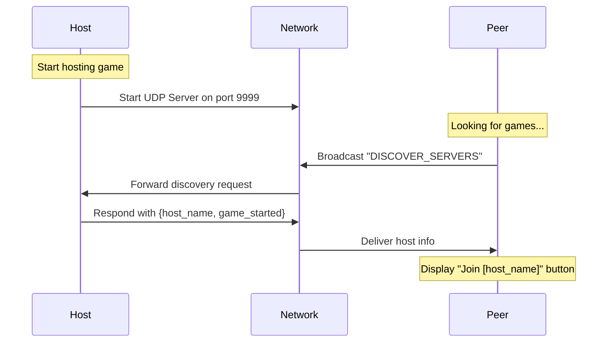
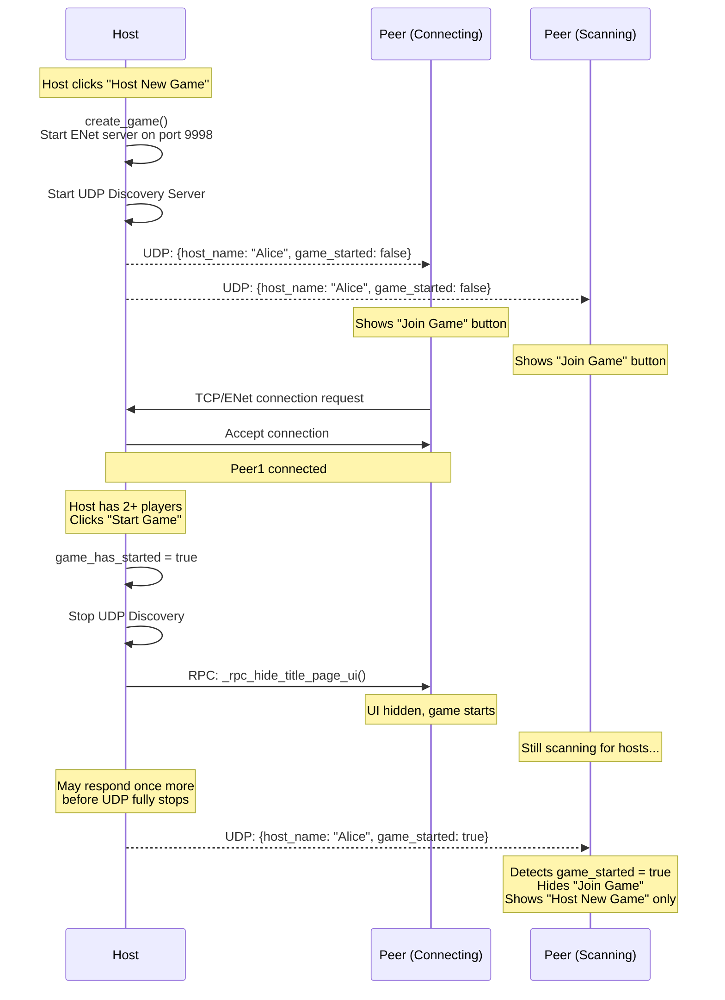

# Multiplayer Architecture

This document describes how the multiplayer networking system works in Liverpool Rummy, including peer discovery, connection management, and game synchronization.

## Overview

Liverpool Rummy uses a **client-server architecture** with UDP broadcast discovery for automatic host detection on local networks. The host acts as the authoritative server, and all other players are clients.

## Key Components

### 1. UDP Discovery System

The game uses UDP broadcast on port `9999` (defined in `Global.DISCOVERY_PORT`) to allow clients to automatically discover hosts on the local network without manually entering IP addresses.

**Key Files:**
- `scenes/title_page_ui.gd` - Implements both UDP server (host) and client (peer) discovery

**How It Works:**



### 2. Game State Synchronization

**Key Files:**
- `global.gd` - Contains `ENetMultiplayerPeer` setup and RPC functions
- `scenes/title_page_ui.gd` - Manages UI state during connection

**Connection Flow:**



### 3. Game State Management

The game uses Godot's built-in multiplayer API with RPC (Remote Procedure Call) for synchronization:

**Server Authority:**
- Host is always `multiplayer.get_unique_id() == 1`
- Host makes all authoritative decisions (card dealing, turn order, validation)
- Clients send actions to host, host validates and broadcasts results

**State Synchronization:**
- `Global.game_state.public_players_info` - Shared state visible to all players
- `Global.private_player_info` - Local player's private information (hand cards)
- `Global.bots_private_player_info` - Bot private information (host only)

### 4. Preventing Late Joins

**Problem:** When a host starts a game, peers who weren't connected yet would still see the "Join Game" button because they only receive UDP broadcasts, not the game start signal.

**Solution:** The UDP discovery broadcast includes a `game_started` flag:

**Implementation Details:**

1. **Host Side** (`title_page_ui.gd`):
   - Tracks `game_has_started` boolean flag
   - Sets to `true` when "Start Game" is clicked
   - Includes in UDP broadcast response: `{'host_name': name, 'game_started': bool}`

2. **Client Side** (`title_page_ui.gd::parse_server_response()`):
   ```gdscript
   if game_started:
       # Remove from joinable hosts
       remote_host_player_name.erase(ip)
       # Force host-only mode
       $JoinGameButton.hide()
       $HostNewGameButton.show()
   ```

3. **Reset Handling** (`_on_reset_game_signal()`):
   - Clears `game_has_started = false`
   - Clears `remote_host_game_started = {}`
   - Allows hosting new games after completion

## Network Ports

- **UDP Discovery:** `9999` (configurable via `Global.DISCOVERY_PORT`)
- **ENet Game Connection:** `9998` (configured in `Global.create_game()` and `Global.join_game()`)

## RPC Functions

Key RPC functions used for synchronization (in `global.gd`):

- `register_player_rpc()` - Client registers with host upon connection
- `_rpc_hide_title_page_ui()` - Host signals all clients to hide UI and start game
- Various game action RPCs for card play, meld validation, etc.

## Testing Multiplayer

To test multiplayer functionality locally:

1. Run multiple instances with different command-line arguments:
   ```bash
   godot -- --server    # Host instance
   godot -- --client1   # Client instance 1
   godot -- --client2   # Client instance 2
   ```

2. Or use the configured debug instances in `.godot/editor/project_metadata.cfg`

## Troubleshooting

### "Join Game" still visible after host starts
- Ensure UDP discovery server continues running when game starts (it should respond with `game_started: true`)
- Verify `game_has_started` flag is set correctly in both `title_page_ui.gd` and `global.gd`
- Check that clients properly parse `game_started` in UDP response and hide join button

### Cannot discover hosts on network
- Verify firewall allows UDP broadcast on port 9999
- Check that hosts and clients are on same subnet
- Ensure `ip_addresses` list contains correct local IPs

### Connection failures
- Verify ENet port 9998 is not blocked by firewall
- Check that `Global.create_game()` successfully creates server
- Ensure client has correct host IP address

## Future Improvements

Potential enhancements to the multiplayer system:

- **Internet Play:** Add relay server or NAT punch-through for non-LAN play
- **Reconnection:** Allow clients to reconnect if connection drops mid-game
- **Spectator Mode:** Allow late joiners to spectate ongoing games
- **Host Migration:** Transfer host authority if original host disconnects

---

*Last Updated: October 2025*
