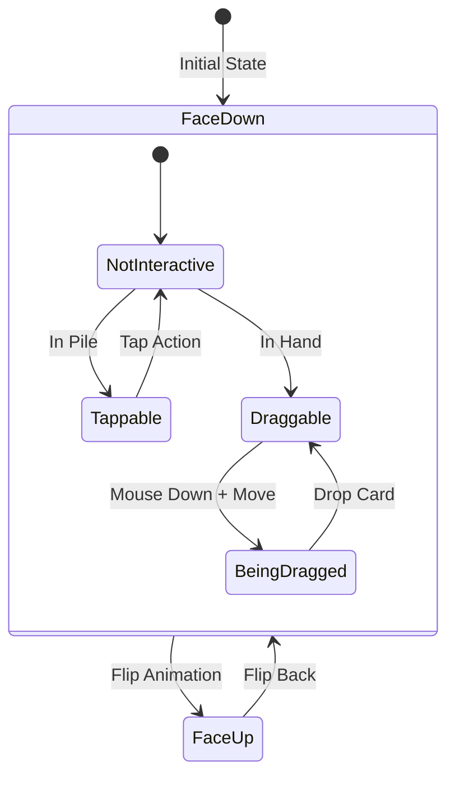
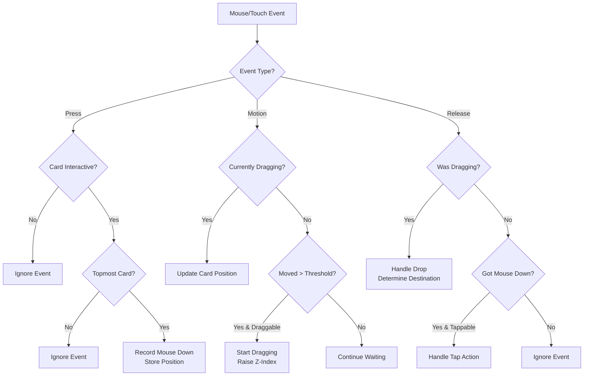
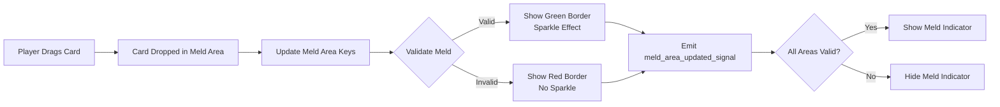
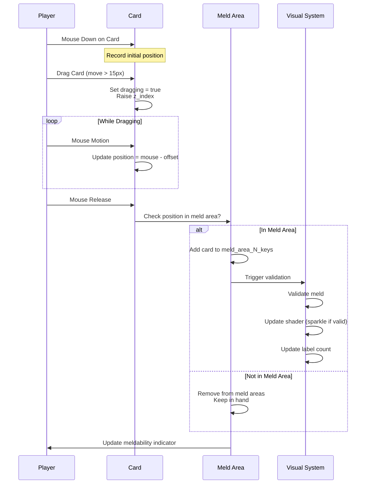

# UI/UX Interaction Patterns

This document describes how players interact with Liverpool Rummy, including card manipulation, meld areas, visual feedback, and touch/mouse controls.

## Overview

Liverpool Rummy features an intuitive drag-and-drop interface with real-time visual feedback. The UI adapts to both mouse (desktop) and touch (mobile/tablet) inputs.

**Key Design Principles:**
- **Direct Manipulation:** Players drag cards to organize their hand
- **Visual Feedback:** Immediate color/shader feedback for valid/invalid melds
- **Forgiving Interactions:** Large touch targets, drag thresholds
- **State-Aware:** UI changes based on game state and turn
- **Family-Friendly:** Positive, encouraging visual design

## Card Interaction System

### Card States



**Card Properties:**
- `is_face_up` - Showing face or back
- `is_draggable` - Can be dragged (cards in player's hand)
- `is_tappable` - Can be tapped/clicked (pile cards, hand cards)
- `z_index` - Stacking order (higher = on top)

### Touch & Mouse Input

**File:** `playing_cards/playing_card.gd`

#### Three Interaction Modes

**1. Tap/Click (Quick Touch)**
```gdscript
// Touch down + touch up within threshold
DRAG_START_THRESHOLD = 15 pixels

if distance_moved < threshold:
    _handle_card_click()
```

**2. Drag (Touch and Move)**
```gdscript
// Touch down + move > threshold
if distance_moved >= DRAG_START_THRESHOLD:
    start_dragging()
    card.z_index = get_top_z_index()  // Raise above other cards
```

**3. Drop (End Drag)**
```gdscript
// Release after dragging
_handle_card_moved(from_position, to_position)
// Determines destination based on drop location
```

#### Input Flow



### Topmost Card Detection

Only the topmost card under cursor responds to input:

**Algorithm:**
```gdscript
func is_topmost_card_under_mouse(mouse_pos: Vector2) -> bool:
    var highest_z_index = self.z_index
    var topmost_card = self

    for card in player_hand:
        if card.is_mouse_over_card(mouse_pos):
            if card.z_index > highest_z_index:
                highest_z_index = card.z_index
                topmost_card = card

    return topmost_card == self
```

This prevents accidentally interacting with cards buried under others.

## Meld Area System

### What are Meld Areas?

Meld areas are designated regions where players arrange cards to form valid groups and runs. The game validates melds in real-time and provides visual feedback.

**Location:** Bottom portion of player's screen area

```
┌─────────────────────────────────────────────────────────────────────────┐
│                                                                         │
│                         Main Public Play Area                           │
│                      (Stock, Discard, Opponents)                        │
│         vvv private vvv                  vvv private vvv                │
├──────────────────────────────────|──────────────────────────────────────┤
│  Meld 1   │  Meld 2   │  Meld 3  │ Free-form player's private hand area |
│  (Cards)  │  (Cards)  │  (Cards) │ ← Meld Areas (50% mark)              |
└─────────────────────────────────────────────────────────────────────────┘
```

### Meld Area Layout

**Rounds 1-3:** Use 2 meld areas
```
┌──────────────┬──────────────┐
│  Meld Area 1 │  Meld Area 2 │
│   0% - 50%   │  50% - 100%  │
└──────────────┴──────────────┘
```

**Rounds 4-7:** Use 3 meld areas
```
┌─────────┬─────────┬──────────┐
│ Meld 1  │ Meld 2  │ Meld 3   │
│ 0%-33%  │ 33%-66% │ 66%-100% │
└─────────┴─────────┴──────────┘
```

**Code Constants** (in `global.gd`):
```gdscript
const MELD_AREA_TOP_PERCENT = 0.7  // Meld areas start at 70% down screen
const MELD_AREA_1_RIGHT_PERCENT = 0.33 // of half of the screen width
const MELD_AREA_2_RIGHT_PERCENT = 0.66 // of half of the screen width
const MELD_AREA_RIGHT_PERCENT = 1.0 // of half of the screen width
```

### Real-Time Validation

**File:** `scripts/meld_area_visual.gd`, `scripts/meld_area_area.gd`

As players drag cards into meld areas, validation happens instantly:



**Validation Per Round:**
```gdscript
match round_num:
    1:  # 2 groups of 3
        meld_area_1: is_valid_group()
        meld_area_2: is_valid_group()
    2:  # 1 group + 1 run
        meld_area_1: is_valid_group()
        meld_area_2: is_valid_run()
    3:  # 2 runs
        meld_area_1: is_valid_run()
        meld_area_2: is_valid_run()
    4:  # 3 groups
        meld_area_1: is_valid_group()
        meld_area_2: is_valid_group()
        meld_area_3: is_valid_group()
    # ... etc
```

### Visual Feedback

**Default State:**
- Semi-transparent background
- Subtle border
- Label showing requirement (e.g., "Book 1 (0)")

**Valid Meld:**
- **Sparkle shader effect** (golden glow)
- Pulsing animation
- Border highlights
- Label updates: "Book 1 (3)" ✓

**Invalid Meld:**
- Default appearance
- No special effects
- Red-tinted border (if implemented)

**Shader:** `shaders/sparkle.gdshader`
```gdscript
shader_params:
    border_width: 10.0
    border_color: Color(1.0, 1.0, 0.8, 1.0)  // Golden
    sparkle_intensity: 0.5
    time_speed: 5.0
```

## Player Turn Indicators

### Visual Indicators

**1. Turn Indicator Rectangle**
```gdscript
// Pulsing scale animation
var rect_scale = abs(sin(time * 0.005)) * 0.2 + 1.0
$TurnIndicatorRect.scale = Vector2(rect_scale, rect_scale)
```

**2. Buy Request Indicator**
```gdscript
// When player has requested to buy
$BuyIndicatorSprite2D.visible = true
$BuyIndicatorSprite2D.scale = pulsing_scale  // 0.8 - 1.0
```

**3. Meld Available Indicator**
```gdscript
// When player can meld their hand
$MeldIndicatorSprite2D.visible = true
$MeldIndicatorSprite2D.scale = pulsing_scale  // 0.8 - 1.0
```

**4. Winning Player Animation**
```gdscript
// Special animation for round winner
$TurnIndicatorRect.scale = pulsing_scale  // 1.0 - 1.5
$TurnIndicatorRect.rotation += 0.01  // Rotating effect
```

## Card Drawing Interactions

### From Stock Pile (Face-Down)

**Interaction:**
- Tap or drag top card of stock pile
- Only available on player's turn
- If buy requests pending, draws from stock allows them

**Flow:**
```
Player Taps Stock Pile
    ↓
Check: Outstanding Buy Request?
    ↓ Yes
Allow Buy (other player gets discard + penalty)
    ↓ No
Draw from Stock
    ↓
Card animates to player's hand
    ↓
Enter PlayerDrewState
```

### From Discard Pile (Face-Up)

**Interaction:**
- Tap or drag visible discard card
- Available to current player OR non-turn players (as buy request)

**Current Player:**
```
Player Taps Discard
    ↓
Draw from Discard
    ↓
Card animates to hand
    ↓
Enter PlayerDrewState
```

**Non-Turn Player:**
```
Player Taps Discard
    ↓
Request to Buy
    ↓
Buy indicator shows
    ↓
Wait for turn player's decision
```

## Organizing Hand in Meld Areas

### Drag and Drop Flow



### Meld Area Detection

**File:** `players/player.gd::_get_playing_card_meld_area_idx()`

```gdscript
func _get_playing_card_meld_area_idx(card: PlayingCard) -> int:
    // Quick reject: Above meld area threshold
    if card.position.y <= screen_height * 0.7:
        return -1

    // Check horizontal position
    var round = Global.game_state.current_round_num

    if round <= 3:  // 2 meld areas
        if card.x >= screen_width * 0.5:
            return 1  // Right area
        return 0      // Left area
    else:  // 3 meld areas
        if card.x >= screen_width * 0.66:
            return 2  // Right area
        elif card.x >= screen_width * 0.33:
            return 1  // Middle area
        return 0      // Left area
```

**Automatic Organization:**
- Cards update position in meld area automatically
- Labels show card count: "Book 1 (3)"
- Validation triggers on every card movement
- Visual feedback immediate

## Discard Action

### Two Ways to Discard

**1. Tap/Click Card in Hand**
```
During PlayerDrewState (after drawing):
    Tap card NOT in meld area
        ↓
    Card discarded
        ↓
    Animates to discard pile
```

**2. Drag to Discard Pile**
```
Drag card from hand
    ↓
Drop within 200 pixels of discard pile position
    ↓
Card discarded
    ↓
Animates to discard pile
```

**Safety Feature:** Cards in meld areas cannot be directly discarded
- Player must drag card out of meld area first
- Prevents accidental discard of organized melds

### Winning Hand Detection

```
Player Discards Last Card (Rounds 1-6)
    ↓
Check: All required melds satisfied?
    ↓ Yes
Player Wins Round!
    ↓
Show winning animation
```

```
Player Melds All Cards (Round 7)
    ↓
Check: Hand completely empty?
    ↓ Yes
Player Wins Round!
    ↓
Show winning animation
```

## Meld Action

### Personal Melding (First Meld)

**Trigger:** Click anywhere on player's own play area when meld indicator shows

**Requirements:**
- All required meld areas must have valid melds
- Meld indicator is pulsing/visible
- Player is on their turn
- Player hasn't melded yet this round

**Visual Flow:**
```
Player organizes cards into meld areas
    ↓
Each area validates in real-time
    ↓
All areas sparkle (golden glow)
    ↓
Meld indicator appears (pulsing)
    ↓
Player clicks anywhere on their area
    ↓
Cards animate to table position
    ↓
Can now add to public melds
```

### Public Melding (Adding to Others' Melds)

**After Personal Meld:**
- Drag card from hand
- Hover over opponent's melded cards
- Drop to add card to their meld

**Valid Public Melds Highlighted:**
- Eligible opponent areas pulse/highlight
- Indicator shows which meld can accept card
- Visual confirmation before drop

**File:** `players/player.gd::_on_card_moved_signal()`

## Visual Feedback System

### Real-Time Validation Indicators

**1. Meld Area Borders**
```gdscript
Valid Meld:
    - Golden sparkle shader
    - Pulsing glow
    - Encouraging visual

Invalid/Incomplete:
    - Default semi-transparent
    - Subtle border
    - Neutral appearance
```

**2. Card Counts**
```gdscript
Label Updates:
    "Book 1 (0)" → "Book 1 (3)" ✓
    "Run 2 (0)"  → "Run 2 (4)" ✓
```

**3. Turn Indicators**
```gdscript
Current Player:
    - Pulsing border around player area
    - Scale: 1.0 - 1.2
    - Color: Bright/visible

Other Players:
    - Neutral appearance
    - No animation
```

**4. Buy Request Indicator**
```
Player requested to buy:
    ├─ BuyIndicator icon visible
    ├─ Pulsing scale animation
    └─ Shows until request resolved
```

**5. Meld Ready Indicator**
```
Can meld hand:
    ├─ MeldIndicator icon visible
    ├─ Pulsing animation
    └─ Clickable area highlighted
```

### Animation Constants

**File:** `players/player.gd`

```gdscript
const ANIMATE_SPEED = 0.005

// Pulsing effect
var pulse = abs(sin(ticks * ANIMATE_SPEED)) * scale_factor + base_scale

// Turn indicator: 1.0 - 1.2 scale
// Buy indicator: 0.8 - 1.0 scale
// Meld indicator: 0.8 - 1.0 scale
// Winner indicator: 1.0 - 1.5 scale + rotation
```

## Card Movement Signals

### Global Signal System

**File:** `global.gd`

```gdscript
signal card_clicked_signal(playing_card, global_position)
signal card_drag_started_signal(playing_card, from_position)
signal card_moved_signal(playing_card, from_position, to_position)
```

### Signal Handlers

**File:** `players/player.gd`

**Click Handler:**
```gdscript
func _on_card_clicked_signal(card, position):
    if card in discard_pile:
        if is_my_turn:
            draw_from_discard()
        else:
            request_to_buy()

    elif card in stock_pile:
        if is_my_turn:
            if has_buy_requests:
                allow_buy()
            else:
                draw_from_stock()

    elif card in my_hand:
        if not in_meld_area:
            discard_card()
        else:
            raise_to_top()  // Bring to front
```

**Move Handler:**
```gdscript
func _on_card_moved_signal(card, from_pos, to_pos):
    var meld_area = determine_meld_area(to_pos)

    if meld_area >= 0:
        // Add to meld area
        add_to_meld_area(card, meld_area)
        update_validation()
    else:
        // Remove from meld areas
        remove_from_all_meld_areas(card)

    if near_discard_pile(to_pos):
        discard_card(card)
```

## State-Dependent Interactions

Different game states enable different interactions:

### TitlePageState / PreGameSetupState
- **No card interaction**
- Only UI buttons active
- Name input, host/join buttons

### TurnDrawState
**Current Player:**
- ✓ Tap/drag from stock pile
- ✓ Tap/drag from discard pile
- ✗ Cannot organize hand yet

**Other Players:**
- ✓ Tap discard to request buy
- ✗ Cannot draw cards
- ✗ Cannot organize hand

### PlayerDrewState
**Current Player:**
- ✓ Drag cards to organize in meld areas
- ✓ Click to discard
- ✓ Drag to discard pile
- ✓ Click player area to meld (if valid)
- ✗ Cannot draw more cards

**Other Players:**
- ✗ Cannot interact with cards
- View-only mode

### NewDiscardState
**All Players:**
- Grace period for buy requests
- Visual indicators for who's buying
- No card manipulation allowed

## Touch-Friendly Design

### Large Touch Targets

```gdscript
// Card hit detection includes padding
const HIT_PADDING = 5.0  // pixels

func get_rect(padding = 5.0) -> Rect2:
    return Rect2(
        position - size/2 - Vector2(padding, padding),
        size + Vector2(padding*2, padding*2)
    )
```

### Drag Threshold

Prevents accidental drags from taps:
```gdscript
const DRAG_START_THRESHOLD = 15  // pixels

// Tap: movement < 15px
// Drag: movement >= 15px
```

### Clear Visual States

- **Can Interact:** Slightly elevated, crisp borders
- **Cannot Interact:** Muted, no highlighting
- **During Action:** Animated feedback

## Error Prevention

### 1. Accidental Discard Prevention
- Cards in meld areas cannot be directly discarded
- Must explicitly drag out of meld area first
- "Are you sure?" implicit through two-step action

### 2. Invalid Meld Prevention
- Real-time validation before allowing personal meld
- Meld button only active when ALL areas valid
- Clear visual feedback on what's wrong

### 3. Wrong Turn Prevention
- Cards not interactable when not player's turn
- Grayed out or standard state
- Only buy request action available

### 4. Topmost Card Selection
- Only top card responds to input
- Prevents buried card selection
- Z-index automatically managed

## Accessibility Features

### Visual
- **High Contrast:** Card faces clear and readable
- **Color Coding:** Suits use distinct colors
- **Size:** Cards large enough to read easily
- **Sparkles:** Clear valid/invalid indication

### Input
- **Mouse Support:** Full desktop compatibility
- **Touch Support:** Mobile/tablet ready
- **Drag Threshold:** Accommodates shaky hands
- **Large Targets:** Easy to hit on small screens

### Feedback
- **Immediate:** No delay in validation
- **Clear:** Obvious valid/invalid states
- **Forgiving:** Easy to undo (drag out of area)
- **Positive:** Encouraging sparkles, no harsh errors

## Performance Optimization

### Efficient Hit Detection
```gdscript
// Early rejection before expensive checks
if not is_draggable and not is_tappable:
    return  // Skip all processing

// Quick spatial rejection
if mouse.y < meld_area_threshold:
    return -1  // Not in meld area
```

### Signal-Based Architecture
- Cards emit signals instead of polling
- Player.gd listens for relevant cards
- Minimal coupling between components

### Z-Index Optimization
```gdscript
// Only update z-index when dragging starts
func _handle_card_drag_started():
    z_index = get_max_z_index() + 1

// Not updated every frame
```

### Shader Performance
- Sparkle shader is lightweight
- Only applied to active meld areas
- Automatically disabled when not needed

## Future UX Enhancements

**Potential Improvements:**

1. **Undo/Redo:** Let players undo meld organization
2. **Auto-Sort:** Button to auto-sort hand by suit/rank
3. **Snap-to-Grid:** Cards align neatly in meld areas
4. **Gesture Support:** Swipe to discard, pinch to zoom
5. **Hints:** Highlight valid meld possibilities
6. **Haptic Feedback:** Vibration on mobile for actions
7. **Sound Effects:** Satisfying audio for card movements
8. **Dark Mode:** Alternative color scheme
9. **Card Zoom:** Tap to enlarge for better visibility
10. **Accessibility Options:** Configurable card sizes, sounds on/off

---

*Last Updated: October 2025*
